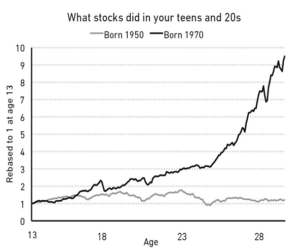
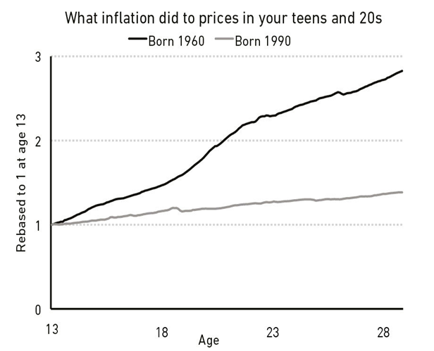
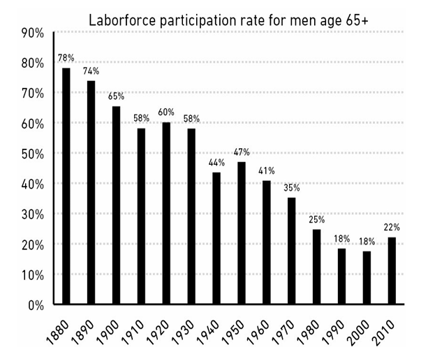

# فصل ۱: هیچ‌کس دیوانه نیست

بگذار درباره‌ی یک مشکل با تو صحبت کنم. شاید این باعث شود نسبت به کارهایی که با پول خودت انجام می‌دهی احساس بهتری داشته باشی و نسبت به کارهایی که دیگران با پولشان می‌کنند، کمتر قضاوت‌گر باشی.

مردم کارهای دیوانه‌واری با پول انجام می‌دهند. اما **هیچ‌کس دیوانه نیست.**

قضیه از این قرار است: آدم‌هایی از نسل‌های مختلف، که توسط والدینی با درآمدهای متفاوت و ارزش‌های متفاوت بزرگ شده‌اند، در نقاط مختلف دنیا، در اقتصادهای مختلف به دنیا آمده‌اند، و بازارهای کاری با انگیزه‌ها و شانس‌های متفاوتی را تجربه کرده‌اند، درس‌های بسیار متفاوتی یاد می‌گیرند.

هر کسی تجربه‌ی منحصر‌به‌فرد خودش را از «نحوه‌ی کارکرد دنیا» دارد. و آنچه تو شخصاً تجربه کرده‌ای، بسیار متقاعدکننده‌تر از چیزی است که دست‌دوم (با خواندن و شنیدن) یاد می‌گیری. بنابراین همه‌ی ما—من، تو، همه—در حالی زندگی را طی می‌کنیم که به مجموعه‌ای از دیدگاه‌ها درباره‌ی کارکرد پول لنگر انداخته‌ایم؛ دیدگاه‌هایی که از یک نفر به نفر دیگر به شدت متفاوت است. چیزی که به نظر تو دیوانگی می‌آید، ممکن است برای من کاملاً منطقی باشد.

کسی که در فقر بزرگ شده، درباره ریسک و پاداش جوری فکر می‌کند که فرزند یک بانکدار ثروتمند حتی اگر تلاش کند هم نمی‌تواند درکش کند.

کسی که در زمان تورم بالا بزرگ شده، چیزی را تجربه کرده که کسی که در زمان ثبات قیمت‌ها بزرگ شده هرگز مجبور به تجربه‌اش نبوده.

دلال سهامی که همه چیزش را در «رکود بزرگ» (Great Depression) از دست داده، چیزی را تجربه کرده که کارمند حوزه تکنولوژی که در شکوه و جلال اواخر دهه ۱۹۹۰ غرق بوده، حتی نمی‌تواند تصورش را بکند.

یک استرالیایی که در ۳۰ سال گذشته هیچ رکودی ندیده، چیزی را تجربه کرده که هیچ آمریکایی‌ای تجربه نکرده است.

و این داستان ادامه دارد. لیست تجربیات بی‌پایان است.

تو چیزهایی درباره پول می‌دانی که من نمی‌دانم، و برعکس. تو با باورها، اهداف و پیش‌بینی‌هایی زندگی می‌کنی که با مال من فرق دارد. این به خاطر این نیست که یکی از ما باهوش‌تر از دیگری است یا اطلاعات بهتری دارد. به خاطر این است که ما زندگی‌های متفاوتی داشته‌ایم که توسط تجربیات متفاوت و به همان اندازه متقاعدکننده شکل گرفته‌اند.

تجربیات شخصی تو با پول شاید ۰.۰۰۰۰۰۰۰۱٪ از آن چیزی باشد که در دنیا اتفاق افتاده، اما شاید ۸۰٪ از نحوه‌ی فکر تو درباره‌ی «کارکرد دنیا» را تشکیل دهد. بنابراین آدم‌های به یک اندازه باهوش، می‌توانند درباره‌ی اینکه چرا رکود اتفاق می‌افتد، چگونه باید سرمایه‌گذاری کرد، اولویت با چیست، چقدر باید ریسک کرد و غیره، با هم اختلاف نظر داشته باشند.

---

فردریک لوئیس آلن در کتابش درباره آمریکای دهه ۱۹۳۰ نوشت که رکود بزرگ «میلیون‌ها آمریکایی را—از درون—برای تمام عمرشان نشان‌دار کرد.» اما دامنه‌ی تجربیات متفاوت بود.

بیست و پنج سال بعد، وقتی جان اف. کندی (JFK) برای ریاست‌جمهوری نامزد شده بود، خبرنگاری از او پرسید که چه خاطره‌ای از دوران رکود دارد. او پاسخ داد:

> «من هیچ دانش دست‌اولی از رکود ندارم. خانواده‌ی من یکی از بزرگ‌ترین ثروت‌های دنیا را داشت و ارزش آن در آن زمان بیشتر از همیشه بود. ما خانه‌های بزرگ‌تر، خدمتکاران بیشتر و سفرهای بیشتری داشتیم. تنها چیزی که مستقیماً دیدم این بود که پدرم چند باغبان اضافه استخدام کرد فقط برای اینکه به آن‌ها شغلی بدهد تا بتوانند غذا بخورند. من واقعاً تا زمانی که در هاروارد درباره رکود نخواندم، چیزی درباره آن یاد نگرفتم.»

این یک نکته‌ی مهم در انتخابات ۱۹۶۰ بود. مردم فکر می‌کردند چطور کسی که هیچ درکی از بزرگ‌ترین داستان اقتصادی نسل گذشته ندارد، می‌تواند مسئول اقتصاد شود؟ این موضوع، از بسیاری جهات، تنها با تجربه‌ی کندی در جنگ جهانی دوم جبران شد. جنگ، دیگر تجربه‌ی احساسی فراگیرِ نسل قبل بود؛ چیزی که رقیب اصلی او، هوبرت هامفری، نداشت.

چالش ما این است که هیچ مقدار مطالعه یا روشنفکری نمی‌تواند واقعاً قدرتِ **ترس** و **عدم قطعیت** را بازسازی کند.

من می‌توانم درباره‌ی اینکه از دست دادن همه چیز در رکود بزرگ چه حسی داشته بخوانم. اما زخم‌های احساسی کسانی که واقعاً آن را تجربه کرده‌اند را ندارم. و کسی که آن دوران را زندگی کرده، نمی‌تواند درک کند چرا کسی مثل من ممکن است درباره‌ی چیزهایی مثل مالکیت سهام اینقدر خونسرد باشد. ما دنیا را از لنزهای متفاوتی می‌بینیم.

صفحات اکسل (Spreadsheets) می‌توانند تناوب تاریخیِ سقوط‌های بزرگ بازار سهام را مدل‌سازی کنند. اما نمی‌توانند آن احساسی را مدل کنند که وقتی به خانه می‌آیی، به بچه‌هایت نگاه می‌کنی و با خودت فکر می‌کنی آیا اشتباهی کرده‌ای که زندگی آن‌ها را تحت تأثیر قرار دهد یا نه. مطالعه‌ی تاریخ باعث می‌شود احساس کنی چیزی را می‌فهمی. اما تا زمانی که آن را زندگی نکنی و شخصاً عواقبش را حس نکنی، ممکن است آنقدر آن را درک نکنی که رفتارت را تغییر دهی.

ما همه فکر می‌کنیم می‌دانیم دنیا چطور کار می‌کند. اما همه‌ی ما فقط برش بسیار باریکی از آن را تجربه کرده‌ایم.

همانطور که مایکل باتنیک (سرمایه‌گذار) می‌گوید: «برخی درس‌ها را باید تجربه کرد تا بتوان فهمید.» ما همگی، به روش‌های مختلف، قربانی این حقیقت هستیم.

---

در سال ۲۰۰۶، دو اقتصاددان به نام‌های اولریک مالمندیر و استفان ناگل از دفتر ملی پژوهش‌های اقتصادی، ۵۰ سال از داده‌های «نظرسنجی مالی مصرف‌کنندگان» را زیر و رو کردند تا با جزئیات ببینند آمریکایی‌ها با پولشان چه می‌کنند.

در تئوری، مردم باید تصمیمات سرمایه‌گذاری خود را بر اساس اهدافشان و ویژگی‌های گزینه‌های سرمایه‌گذاریِ موجود در آن زمان بگیرند.

اما این کاری نیست که مردم انجام می‌دهند.

اقتصاددانان دریافتند که تصمیمات سرمایه‌گذاریِ تمام‌عمرِ افراد، به شدت به تجربیاتی گره خورده است که آن سرمایه‌گذاران در نسل خودشان داشته‌اند—به‌ویژه تجربیات اوایل بزرگسالی‌شان.

اگر در زمانی بزرگ شده باشید که تورم بالا بوده، در اواخر عمر پول کمتری در اوراق قرضه (Bonds) سرمایه‌گذاری می‌کنید نسبت به کسانی که در زمان تورم پایین بزرگ شده‌اند. اگر تصادفاً در زمانی بزرگ شده باشید که بازار سهام قوی بوده، در اواخر عمر پول بیشتری در سهام می‌گذارید نسبت به کسانی که در زمان ضعف بازار سهام بزرگ شده‌اند.

اقتصاددانان نوشتند: «یافته‌های ما نشان می‌دهد که تمایل سرمایه‌گذاران فردی به پذیرش ریسک، به **تاریخچه‌ی شخصی** بستگی دارد.»

نه هوش، نه تحصیلات، و نه پیچیدگی ذهنی. فقط شانسِ محضِ اینکه کی و کجا به دنیا آمده‌اید.

---

روزنامه فایننشال تایمز در سال ۲۰۱۹ با بیل گراس، مدیر مشهور صندوق‌های اوراق قرضه، مصاحبه کرد. در مقاله آمده بود: «گراس اعتراف می‌کند که اگر یک دهه زودتر یا دیرتر به دنیا آمده بود، احتمالاً امروز در این جایگاه نبود.» دوران حرفه‌ای گراس تقریباً به طور کامل با سقوط یک‌نسلیِ نرخ‌های بهره همزمان شد که باعث افزایش قیمت اوراق قرضه شد. این جور چیزها فقط روی فرصت‌هایی که با آن‌ها روبرو می‌شوید تأثیر نمی‌گذارند؛ بلکه روی طرز فکر شما درباره‌ی آن فرصت‌ها هم تأثیر می‌گذارند. برای گراس، اوراق قرضه ماشین‌های تولید ثروت بودند. برای نسل پدرش، که با تورم بالاتر بزرگ شده و آن را تحمل کرده بودند، اوراق قرضه ممکن بود به عنوان کوره‌های سوزاندن ثروت دیده شوند.

تفاوت‌ها در نحوه‌ی تجربه‌ی پول توسط مردم کوچک نیست، حتی بین کسانی که فکر می‌کنید خیلی شبیه هم هستند.

بازار سهام را در نظر بگیرید. اگر در سال ۱۹۷۰ به دنیا آمده باشید، شاخص S&P 500 در دوران نوجوانی و بیست‌سالگی شما (با احتساب تورم) تقریباً ۱۰ برابر شده است. این یک بازدهی شگفت‌انگیز است. اما اگر در سال ۱۹۵۰ به دنیا آمده باشید، بازار در دوران نوجوانی و بیست‌سالگی شما (با احتساب تورم) عملاً هیچ‌جا نرفته است.

دو گروه از مردم، که فقط به خاطر شانسِ سالِ تولدشان از هم جدا شده‌اند، زندگی را با دیدگاهی کاملاً متفاوت درباره‌ی نحوه‌ی کارکرد بازار سهام طی می‌کنند:

 

یا مثلاً **تورم**. اگر در دهه‌ی ۱۹۶۰ در آمریکا به دنیا آمده بودی، تورم در دوران نوجوانی و ۲۰ سالگی‌ات—یعنی همان سال‌های حساس جوانی که داری پایه‌ی دانش خودت را درباره‌ی نحوه‌ی کارکرد اقتصاد می‌سازی—قیمت‌ها را بیش از سه برابر افزایش می‌داد. این خیلی زیاد است!

تو صف‌های طولانی پمپ‌بنزین را به خاطر می‌آوردی و چک‌های حقوقی را می‌دیدی که نسبت به قبلی‌ها، خیلی زودتر تمام می‌شدند و قدرت خریدشان به وضوح کمتر شده بود. اما اگر متولد سال ۱۹۹۰ باشی، تورم در تمام طول زندگی‌ات آنقدر پایین بوده که احتمالاً حتی یک بار هم از ذهنت خطور نکرده است.

 

نرخ بیکاری سراسری آمریکا در نوامبر ۲۰۰۹ حدود ۱۰ درصد بود. اما نرخ بیکاری برای مردان سیاه‌پوست ۱۶ تا ۱۹ ساله‌ای که دیپلم نداشتند، **۴۹ درصد** بود. در مقابل، برای زنان سفیدپوست بالای ۴۵ سال با مدرک دانشگاهی، این نرخ فقط **۴ درصد** بود.

بازارهای بورس محلی در آلمان و ژاپن طی جنگ جهانی دوم کلاً محو شدند. مناطق وسیعی بمباران و ویران شدند. در پایان جنگ، مزارع آلمان فقط به اندازه‌ای غذا تولید می‌کردند که به شهروندان کشور روزانه ۱۰۰۰ کالری برسد. حالا این را مقایسه کنید با آمریکا، جایی که بازار سهام از سال ۱۹۴۱ تا پایان ۱۹۴۵ بیش از دو برابر رشد کرد و اقتصاد در قوی‌ترین حالت خود در دو دهه‌ی اخیر بود.

هیچ‌کس نباید انتظار داشته باشد اعضای این گروه‌ها در ادامه‌ی زندگی‌شان تفکر یکسانی درباره‌ی تورم داشته باشند. یا درباره‌ی بازار سهام، بیکاری، یا به طور کلی «پول».

نباید انتظار داشت که آن‌ها به اطلاعات مالی واکنش یکسانی نشان دهند. هیچ‌کس نباید فرض کند که آن‌ها تحت تأثیر انگیزه‌های مشابهی هستند یا به منابع مشاوره‌ای یکسانی اعتماد می‌کنند.

دیدگاه آن‌ها نسبت به پول در **دنیاهای متفاوتی** شکل گرفته است. و وقتی قضیه این باشد، دیدگاهی درباره پول که یک گروه از مردم فکر می‌کنند «احمقانه» است، می‌تواند برای گروه دیگر کاملاً «منطقی» به نظر برسد.

---

چند سال پیش، نیویورک تایمز گزارشی درباره شرایط کاری «فاکس‌کان» (تولیدکننده‌ی بزرگ قطعات الکترونیکی تایوانی) منتشر کرد. شرایط اغلب وحشتناک بود و خوانندگان به‌حق برآشفته شدند. اما یک پاسخ خیره‌کننده به این گزارش از طرف برادرزاده‌ی یکی از کارگران چینی منتشر شد که در بخش نظرات نوشت:

> «عمه‌ی من چندین سال در جایی کار کرد که آمریکایی‌ها به آن می‌گویند "کارگاه استثماری" (Sweatshop). کار سختی بود؛ ساعات طولانی، دستمزد ناچیز و شرایط کاری بد. اما می‌دانید عمه‌ی من قبل از کار در آن کارخانه چه کار می‌کرد؟ او یک روسپی بود.
> به نظر من، ایده‌ی کار در یک کارخانه در مقایسه با آن سبک زندگی قبلی، یک پیشرفت است. من می‌دانم که عمه‌ی من ترجیح می‌دهد توسط یک رئیس سرمایه‌دارِ خبیث در ازای چند دلار "استثمار" شود، تا اینکه بدنش توسط چندین مرد در ازای چند سنت مورد سوءاستفاده قرار بگیرد.
> به همین دلیل است که من از طرز فکر بسیاری از آمریکایی‌ها ناراحتم. ما فرصت‌های غرب را نداریم. زیرساخت‌های دولتی ما متفاوت است. کشور ما متفاوت است. بله، کار در کارخانه سخت است. آیا می‌تواند بهتر باشد؟ بله، اما فقط زمانی که آن را با شغل‌های آمریکایی مقایسه کنید.»

من نمی‌دانم با این نظر چه کار کنم. بخشی از من می‌خواهد به شدت با آن مخالفت کند و بخشی دیگر می‌خواهد درکش کند. اما این مثالِ بارزی است از اینکه چطور تجربیات متفاوت می‌توانند به دیدگاه‌های کاملاً متفاوتی در موضوعاتی منجر شوند که یک طرف ماجرا فکر می‌کند آن موضوع کاملاً «سیاه و سفید» است.

---

هر تصمیمی که مردم با پول می‌گیرند، با گذاشتن اطلاعاتی که در آن لحظه دارند در **مدل ذهنیِ منحصر‌به‌فردشان** توجیه می‌شود.

این آدم‌ها ممکن است اطلاعات غلط داشته باشند، ریاضی‌شان ضعیف باشد، فریب بازاریابی‌های بد را بخورند یا اصلاً ندانند دارند چه کار می‌کنند. اما هر تصمیم مالی که یک نفر می‌گیرد، در آن لحظه برای خودش منطقی است. آن‌ها داستانی برای خودشان تعریف می‌کنند که ریشه در تجربیاتشان دارد.

یک مثال ساده: **بلیط‌های بخت‌آزمایی (لاتاری).**

آمریکایی‌ها روی‌هم‌رفته برای لاتاری بیشتر از مجموعِ سینما، بازی‌های ویدیویی، موسیقی، مسابقات ورزشی و کتاب هزینه می‌کنند! و چه کسانی این بلیط‌ها را می‌خرند؟ عمدتاً **فقرا**.

کم‌درآمدترین خانوارهای آمریکا به طور متوسط سالانه ۴۱۲ دلار برای لاتاری خرج می‌کنند؛ یعنی ۴ برابرِ ثروتمندترین گروه‌ها. از طرفی ۴۰ درصد آمریکایی‌ها نمی‌توانند در یک وضعیت اضطراری ۴۰۰ دلار جور کنند. یعنی همان‌هایی که لاتاری می‌خرند، همان‌هایی هستند که پس‌انداز اضطراری ندارند. آن‌ها چتر نجات زندگی‌شان را پای چیزی می‌ریزند که شانس برنده شدنش «یک در میلیون» است.

این به نظر من و تو دیوانگی است. اما اگر کمی به خودمان فشار بیاوریم، شاید استدلال آن‌ها را درک کنیم:

> «ما با حقوقِ بخور‌ونمیر زندگی می‌کنیم و پس‌انداز کردن برایمان رویاست. ما نمی‌توانیم از پسِ تعطیلات شیک، ماشین نو یا خانه‌ی خوب بربیاییم. خریدن یک بلیط لاتاری، تنها زمانی در زندگی ماست که می‌توانیم **رویای ملموسی** از داشتن چیزهایی را در سر بپرورانیم که شما همین الان دارید و برایتان عادی شده است. ما داریم پولِ یک "رویا" را می‌دهیم و شما شاید این را نفهمید چون خودتان دارید در همان رویا زندگی می‌کنید.»

---

نکته‌ی مهم دیگر این است که بدانیم موضوع «سرمایه‌گذاری» چقدر جدید و نوپا است. پول قدیمی است، اما «پس‌انداز و سرمایه‌گذاری مدرن» عملاً نوزاد محسوب می‌شود.

مثلاً **بازنشستگی** را در نظر بگیرید. تا قبل از جنگ جهانی دوم، اکثر آمریکایی‌ها تا لحظه‌ی مرگ کار می‌کردند. نرخ مشارکت نیروی کار برای مردان بالای ۶۵ سال تا دهه‌ی ۱۹۴۰، بالای ۵۰ درصد بود:

 

هدف «تأمین اجتماعی» تغییر این وضعیت بود. اما مزایای اولیه‌ی آن اصلاً شبیه به یک مستمری واقعی نبود. وقتی «ایدا می فولر» اولین چک تأمین اجتماعی را در سال ۱۹۴۰ نقد کرد، مبلغش ۲۲.۵۴ دلار بود (معادل ۴۴۱ دلار امروز با احتساب تورم). تا قبل از دهه‌ی ۱۹۸۰ طول کشید تا میانگین چک‌های تأمین اجتماعی بازنشستگان از مرز ۱۰۰۰ دلار در ماه (با ارزش امروز) عبور کند. تا اواخر دهه‌ی ۱۹۶۰، بیش از یک‌چهارم آمریکایی‌های بالای ۶۵ سال توسط اداره آمار در دسته‌ی «زیر خط فقر» طبقه‌بندی می‌شدند.

یک باور عمومی وجود دارد که می‌گوید: «قدیما همه مستمری خصوصی داشتند.» اما این به شدت اغراق‌آمیز است. طبق گزارش موسسه تحقیقاتی مزایای کارکنان: «در سال ۱۹۷۵، فقط یک‌چهارم افراد بالای ۶۵ سال درآمد مستمری داشتند.» و در میان همان اقلیت خوش‌شانس، فقط ۱۵ درصد از درآمد خانوارشان از طریق مستمری تأمین می‌شد.

نیویورک تایمز در سال ۱۹۵۵ درباره‌ی میل فزاینده اما ناتوانیِ مداوم برای بازنشستگی نوشت: «اگر بخواهیم یک ضرب‌المثل قدیمی را بازسازی کنیم: همه درباره‌ی بازنشستگی حرف می‌زنند، اما ظاهراً تعداد بسیار کمی قدمی برای آن برمی‌دارند.»

تا دهه‌ی ۱۹۸۰ طول کشید تا این ایده که «هر کسی لیاقت و باید یک بازنشستگی آبرومندانه داشته باشد» جا افتاد. و راه رسیدن به آن بازنشستگی آبرومندانه از آن زمان به بعد، این انتظار بوده که هر کسی باید پول خودش را پس‌انداز و سرمایه‌گذاری کند.

بگذارید دوباره تأکید کنم که این ایده چقدر **جدید** است: حساب 401(k) که ستون فقراتِ پس‌انداز بازنشستگی در آمریکاست، تا سال ۱۹۷۸ اصلاً وجود نداشت. حساب Roth IRA (نوعی حساب بازنشستگی معاف از مالیات) تازه در سال ۱۹۹۸ متولد شد. اگر این حساب یک آدم بود، الان سنش به زور به سن قانونی می‌رسید!

پس نباید باعث تعجب کسی شود که بسیاری از ما در پس‌انداز و سرمایه‌گذاری برای بازنشستگی ضعیف عمل می‌کنیم. **ما دیوانه نیستیم؛ ما فقط همگی تازه‌واردیم.**

همین موضوع درباره‌ی دانشگاه هم صدق می‌کند. سهم آمریکایی‌های بالای ۲۵ سال که مدرک لیسانس دارند، از کمتر از ۱ نفر در ۲۰ نفر در سال ۱۹۴۰، به ۱ نفر در ۴ نفر تا سال ۲۰۱۵ رسیده است. در همین مدت، میانگین شهریه‌ی دانشگاه (با احتساب تورم) بیش از چهار برابر شده است. وقتی چیزی به این بزرگی و مهمی با این سرعت به جامعه برخورد می‌کند، توضیح می‌دهد که چرا مثلاً بسیاری از مردم در ۲۰ سال گذشته تصمیمات بدی درباره‌ی وام‌های دانشجویی گرفته‌اند. هیچ دهه‌ی انباشته‌ای از تجربه وجود ندارد که بخواهیم از آن درس بگیریم. ما داریم «بدون نقشه» جلو می‌رویم.

همین‌طور برای «صندوق‌های شاخصی» که کمتر از ۵۰ سال قدمت دارند، یا «صندوق‌های پوشش ریسک» که تازه در ۲۵ سال اخیر اوج گرفته‌اند. حتی استفاده‌ی گسترده از بدهی‌های مصرفی—مثل وام مسکن، کارت‌های اعتباری و وام خودرو—تا بعد از جنگ جهانی دوم (زمانی که قانون GI Bill وام گرفتن را برای میلیون‌ها آمریکایی آسان کرد) فراگیر نشده بود.

سگ‌ها ۱۰ هزار سال پیش اهلی شدند و هنوز هم برخی از رفتارهای اجداد وحشی‌شان را حفظ کرده‌اند. با این حال، ما اینجا هستیم؛ با کلاً بین ۲۰ تا ۵۰ سال تجربه در سیستم مالی مدرن، و انتظار داریم که کاملاً با آن سازگار شده باشیم!

برای موضوعی که این‌قدر تحت تأثیر «احساسات» در برابر «واقعیات» است، این یک مشکل بزرگ است. و همین موضوع به ما کمک می‌کند بفهمیم چرا همیشه آن کاری را که «باید» با پولمان انجام دهیم، انجام نمی‌دهیم.

همه‌ی ما کارهای دیوانه‌واری با پول انجام می‌دهیم، چون همگی در این بازی نسبتاً تازه‌واردیم؛ و چیزی که به نظر تو دیوانگی می‌آید، ممکن است برای من کاملاً منطقی باشد. اما هیچ‌کس دیوانه نیست—ما همگی بر اساس تجربیات منحصربه‌فرد خودمان تصمیماتی می‌گیریم که در آن لحظه‌ی خاص، برایمان منطقی به نظر می‌رسند.

حالا بگذار داستانی برایت تعریف کنم درباره‌ی اینکه بیل گیتس چطور ثروتمند شد.
