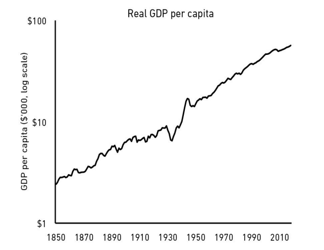

# فصل پنجم: ثروتمند شدن مقابل با ثروتمند ماندن

سرمایه‌گذاری خوب لزوماً به معنی تصمیم‌گیری‌های خوب نیست. بلکه به معنی این است که به طور مداوم از خراب کردن کار خود اجتناب کنید.

راه‌های زیادی برای ثروتمند شدن وجود دارد، و کتاب‌های زیادی در مورد نحوه انجام آن نوشته شده است.
اما تنها یک راه برای باقی ماندن در ثروت وجود دارد: ترکیبی از صرفه‌جویی و پارانویا.
و این موضوعی است که ما به اندازه کافی به آن پرداخته نمی‌شود.

بیایید با یک داستان کوتاه از دو سرمایه‌گذار شروع کنیم که هیچ‌کدام دیگری را نمی‌شناختند، اما مسیرهایشان تقریباً یک قرن پیش به طور جالبی با هم تلاقی کرد.

جسی لیورمور بزرگترین معامله‌گر بازار سهام زمان خود بود. او در سال 1877 به دنیا آمد و قبل از آنکه بیشتر مردم بدانند چنین حرفه‌ای وجود دارد، به عنوان یک معامله‌گر حرفه‌ای شروع به کار کرد. تا سن 30 سالگی، او معادل 100 میلیون دلار به پول امروز ثروت داشت.

تا سال 1929، جسی لیورمور یکی از شناخته‌شده‌ترین سرمایه‌گذاران جهان بود. سقوط بازار سهام در آن سال که بحران بزرگ اقتصادی را آغاز کرد، میراث او را در تاریخ تثبیت کرد.
بیش از یک سوم ارزش بازار سهام در هفته‌ای که در اکتبر 1929 رخ داد و روزهای آن بعدها به نام‌های دوشنبه سیاه، سه‌شنبه سیاه و پنج‌شنبه سیاه شناخته شد، از بین رفت.

همسر لیورمور، دوروتی، زمانی که شوهرش در 29 اکتبر به خانه برگشت، از بدترین چیزها می‌ترسید. گزارش‌هایی در مورد خودکشی‌های سفته‌بازان وال استریت در حال پخش شدن در نیویورک بود. او و فرزندانش با اشک به استقبال جسی رفتند، در حالی که مادر او آن‌قدر پریشان بود که در اتاقی دیگر پنهان شده و جیغ می‌کشید.
جسی، طبق گفته بیوگرافی‌نویسش، تام روبیتون، چند لحظه گیج ایستاد تا متوجه شود چه اتفاقی در حال وقوع است.
سپس این خبر را به خانواده‌اش داد: در یک حرکت هوشمندانه و شانس، او بازار را به فروش رسانده بود و شرط بندی کرده بود که سهام کاهش خواهد یافت.
«یعنی ما ورشکسته نشده‌ایم؟» دوروتی پرسید.
«نه عزیزم، من بهترین روز معاملاتی‌ام را داشته‌ام — ما فوق‌العاده ثروتمند هستیم و می‌توانیم هر کاری که دوست داریم انجام دهیم»، جسی گفت.
دوروتی به سمت مادرش دوید و به او گفت که آرام باشد.

در یک روز، جسی لیورمور معادل بیش از 3 میلیارد دلار به دست آورد.
در یکی از بدترین ماه‌های تاریخ بازار سهام، او یکی از ثروتمندترین مردان جهان شد.

در حالی که خانواده لیورمور در جشن موفقیت غیرقابل تصورشان بودند، مرد دیگری در خیابان‌های نیویورک به طور ناامیدانه می‌گشت.
آبراهام جرمانسکی یک توسعه‌دهنده املاک چند میلیون دلاری بود که در دوران شکوفایی دهه 1920 ثروتی به دست آورده بود. در حالی که اقتصاد در حال رونق بود، او همان‌طور که تقریبا هر نیویورکی موفق دیگری در اواخر دهه 1920 انجام داد، روی بازار سهام پر رونق شرط‌بندی کرده بود.
در 26 اکتبر 1929، نیویورک تایمز مقاله‌ای منتشر کرد که در دو پاراگراف پایان تراژیکی را تصویر می‌کند:
«برنارد ه. سندلر، وکیل 225 برادوی، دیروز صبح توسط خانم آبراهام جرمانسکی از مانت ورنن خواسته شد تا به پیدا کردن شوهرش که از پنج‌شنبه صبح ناپدید شده بود کمک کند. جرمانسکی، که 50 ساله و یک معامله‌گر املاک در شرق نیویورک بود، گفته بود که به سندلر گفته‌اند که یک دوست او را پنج‌شنبه شب در نزدیکی بورس وال استریت دیده است. طبق گفته آن فرد، شوهر او در حال پاره کردن یک نوار از تیکر تیپ و پخش کردن آن روی پیاده‌رو در حالی که به سمت برادوی می‌رفت بود.»
و این‌گونه بود که ما از آخرین خبر درباره آبراهام جرمانسکی می‌دانیم.

در اینجا تضادی وجود دارد.
سقوط بازار در اکتبر 1929 باعث شد جسی لیورمور یکی از ثروتمندترین مردان جهان شود. این اتفاق آبراهام جرمانسکی را ورشکسته کرد و شاید جانش را گرفت.

اما چهار سال بعد، این دو داستان دوباره به هم رسیدند.
پس از بحران 1929، لیورمور که پر از اعتماد به نفس شده بود، شرط‌بندی‌های بزرگتر و بزرگتر کرد. او بالاخره در قرض‌های زیاد غرق شد و در نهایت همه چیز را در بازار سهام از دست داد.
بی‌پول و شرمنده، او در سال 1933 برای دو روز ناپدید شد. همسرش برای یافتن او به جست‌وجو پرداخت. «جسی ال. لیورمور، معامله‌گر بازار سهام، از خیابان 1100 پارک ناپدید شده و از ساعت 3 بعد از ظهر دیروز دیده نشده است»، نیویورک تایمز در 1933 نوشت.
او برگشت، اما مسیرش تعیین شده بود. لیورمور در نهایت جان خود را گرفت.

زمان متفاوت بود، اما جرمانسکی و لیورمور یک ویژگی شخصیتی مشترک داشتند: هر دو در ثروتمند شدن بسیار ماهر بودند، اما به یک اندازه در نگه داشتن ثروت خود ضعیف بودند.

حتی اگر «ثروتمند» کلمه‌ای نباشد که آن را برای خود به کار ببرید، درس‌هایی که از این مشاهده می‌توان آموخت، برای همه افراد، در هر سطح درآمدی کاربرد دارد.
پول به دست آوردن یک چیز است.
آن را نگه داشتن چیز دیگری است.

اگر بخواهم موفقیت مالی را در یک کلمه خلاصه کنم، آن کلمه «بقا» است.

همان‌طور که در فصل ۶ خواهیم دید، ۴۰٪ از شرکت‌هایی که آن‌قدر موفق می‌شوند که وارد بورس شوند، در گذر زمان عملاً تمام ارزششان را از دست می‌دهند. فهرست فوربس ۴۰۰ ثروتمندترین آمریکایی‌ها به طور متوسط در هر دهه حدود ۲۰٪ جابه‌جایی دارد؛ آن هم به دلایلی که ربطی به مرگ یا انتقال ثروت به اعضای خانواده ندارد.

سرمایه‌داری سخت است. اما بخشی از دلیل این اتفاق‌ها این است که پول درآوردن و پول نگه داشتن دو مهارت متفاوت‌اند.

پول درآوردن نیازمند ریسک‌پذیری، خوش‌بینی و وارد میدان شدن است.
اما پول نگه داشتن دقیقاً برعکسِ ریسک‌کردن است. نیاز به فروتنی دارد و نوعی ترس سالم که بدانی آنچه ساخته‌ای می‌تواند به همان سرعتی که آمده از دست برود. نیاز به صرفه‌جویی دارد و پذیرش این واقعیت که دست‌کم بخشی از موفقیتت نتیجه شانس بوده، پس نمی‌شود روی تکرار همیشگی گذشته حساب کرد.

مایکل موریتز، مدیر میلیاردر Sequoia Capital، یک‌بار توسط چارلی رز پرسیده شد چرا سیکویا این‌قدر موفق است. موریتز به «ماندگاری» اشاره کرد و گفت بعضی شرکت‌های سرمایه‌گذاری پنج یا ده سال می‌درخشند، اما سیکویا چهار دهه دوام آورده است. رز پرسید چرا؟

موریتز گفت: «فکر می‌کنم ما همیشه از ورشکست شدن ترسیده‌ایم.»
رز: «واقعاً؟ پس ترس است؟ فقط پارانوئیدها زنده می‌مانند؟»
موریتز: «خیلی حقیقت دارد… ما فرض می‌کنیم فردا شبیه دیروز نیست. نمی‌توانیم روی افتخارات گذشته بخوابیم. نمی‌توانیم آسوده‌خاطر شویم. نمی‌توانیم فرض کنیم موفقیت دیروز، خوش‌شانسی فردا را تضمین می‌کند.»

باز هم همان کلمه: بقا.

نه «رشد»، نه «هوش»، نه «بینش». توانایی اینکه مدت طولانی در بازی بمانی، بدون نابود شدن یا مجبور شدن به کنار کشیدن، بزرگ‌ترین تفاوت را ایجاد می‌کند. این باید ستون اصلی استراتژی تو باشد؛ چه در سرمایه‌گذاری، چه در مسیر شغلی، چه در کسب‌وکاری که داری.

دو دلیل وجود دارد که ذهنیت بقا در پول این‌قدر مهم است.

اولی واضح است: سودی آن‌قدر بزرگ نیست که ارزش نابود کردن خودت را داشته باشد.

دومی، همان‌طور که در فصل ۴ دیدیم، ریاضیات ضدشهودی بهره مرکب است.

بهره مرکب فقط وقتی کار می‌کند که به دارایی سال‌ها و سال‌ها زمان بدهی تا رشد کند. مثل کاشتن درخت بلوط است: یک سال رشد تقریباً چیزی نشان نمی‌دهد، ده سال می‌تواند تفاوت معناداری بسازد، و پنجاه سال می‌تواند چیزی واقعاً خارق‌العاده خلق کند.

اما رسیدن به آن رشد خارق‌العاده نیازمند این است که از تمام بالا و پایین‌های غیرقابل پیش‌بینی که همه در طول زمان تجربه می‌کنند جان سالم به در ببری.

ما می‌توانیم سال‌ها وقت صرف کنیم تا بفهمیم بافت چطور بازدهی‌هایش را به دست آورد: چطور بهترین شرکت‌ها را پیدا کرد، ارزان‌ترین سهام‌ها را خرید، بهترین مدیران را شناخت. این سخت است. اما چیزی که کمتر سخت و به همان اندازه مهم است، توجه به کارهایی است که او نکرد.

او با بدهی از خود بی‌خود نشد.
در ۱۴ رکودی که تجربه کرد وحشت‌زده نفروخت.
اعتبار کسب‌وکارش را خراب نکرد.
خودش را به یک استراتژی، یک جهان‌بینی یا یک مُد زودگذر نچسباند.
به پول دیگران وابسته نشد.
خودش را نسوزاند و کنار نکشید.

او زنده ماند. بقا به او ماندگاری داد. و ماندگاری — سرمایه‌گذاری مداوم از ۱۰ سالگی تا دست‌کم ۸۹ سالگی — همان چیزی بود که اجازه داد بهره مرکب معجزه کند. این یک نکته، از همه مهم‌تر است در توضیح موفقیت او.

برای اینکه منظورم را دقیق بفهمی، باید داستان ریک گِرین را بشنوی.

احتمالاً زوج سرمایه‌گذاری وارن بافت و چارلی مانگر را شنیده‌ای. اما ۴۰ سال پیش عضو سومی هم بود: ریک گرین.

وارن، چارلی و ریک با هم سرمایه‌گذاری می‌کردند و با هم مدیران شرکت‌ها را بررسی می‌کردند. بعد ریک، دست‌کم نسبت به موفقیت بافت و مانگر، کم‌کم ناپدید شد.

سرمایه‌گذار موهنیش پابرای یک‌بار از بافت پرسید چه بلایی سر ریک آمد. او نقل می‌کند:

بافت گفت: «من و چارلی همیشه می‌دانستیم فوق‌العاده ثروتمند می‌شویم. عجله‌ای نداشتیم؛ می‌دانستیم اتفاق می‌افتد. ریک به اندازه ما باهوش بود، اما عجله داشت.»

در رکود ۱۹۷۳–۱۹۷۴ ریک با وام‌های مارجین اهرم شده بود. بازار در آن دو سال نزدیک ۷۰٪ سقوط کرد و او با مارجین کال روبه‌رو شد. مجبور شد سهام برکشایرش را به وارن بفروشد — خود وارن گفت «من سهام برکشایر ریک را خریدم» — هر سهم زیر ۴۰ دلار. ریک مجبور به فروش شد چون اهرم داشت.

چارلی، وارن و ریک به یک اندازه در ثروتمند شدن مهارت داشتند.
اما وارن و چارلی مهارت اضافه‌ای داشتند: ثروتمند ماندن.
و در بلندمدت، همین مهارتی است که بیش از همه اهمیت دارد.

نسیم طالب این‌طور می‌گوید:
«داشتن یک مزیت و زنده ماندن دو چیز متفاوت‌اند؛ اولی به دومی نیاز دارد. باید از نابودی اجتناب کنی. به هر قیمتی.»

به‌کار بردن ذهنیت بقا در دنیای واقعی به درک سه چیز برمی‌گردد.

اول:
بیش از اینکه دنبال بازده بزرگ باشم، می‌خواهم از نظر مالی نشکن باشم. و اگر نشکن باشم، احتمالاً بازده بزرگ‌تر هم می‌گیرم، چون آن‌قدر می‌مانم که بهره مرکب کار خودش را بکند.

هیچ‌کس دوست ندارد در بازار صعودی پول نقد نگه دارد. همه می‌خواهند دارایی‌هایی داشته باشند که زیاد بالا می‌روند. نگه داشتن پول نقد در بازار گاوی تو را محافظه‌کار نشان می‌دهد، چون دائماً می‌بینی چه مقدار بازده را از دست می‌دهی. اگر نقد ۱٪ بدهد و سهام ۱۰٪، آن فاصله ۹٪ هر روز آزارت می‌دهد.

اما اگر همین پول نقد باعث شود در بازار نزولی مجبور به فروش سهامت نشوی، بازده واقعی آن نقد دیگر ۱٪ نیست؛ می‌تواند چندین برابر باشد. چون جلوگیری از یک فروش وحشت‌زده و بدزمان، می‌تواند بیشتر از انتخاب ده‌ها سهم برنده روی بازده عمرت اثر بگذارد.

بهره مرکب به بازده‌های عظیم نیاز ندارد. بازده‌های «خوب» که بدون وقفه و برای طولانی‌ترین زمان حفظ شوند — مخصوصاً در دوره‌های آشوب — همیشه برنده‌اند.

دوم:
برنامه‌ریزی مهم است، اما مهم‌ترین بخش هر برنامه این است که برنامه‌ریزی کنی برنامه طبق برنامه پیش نرود.

برنامه می‌ریزی، خدا می‌خندد. برنامه‌ریزی مالی مهم است چون نشان می‌دهد کارت در محدوده معقول است یا نه. اما تقریباً هیچ برنامه‌ای از برخورد اول با واقعیت جان سالم به در نمی‌برد. اگر برای ۲۰ سال آینده درآمد، پس‌انداز و بازده بازار را پیش‌بینی می‌کنی، به اتفاقات ۲۰ سال گذشته فکر کن که کسی نمی‌توانست پیش‌بینی کند: یازده سپتامبر، حباب و سقوط مسکن، بحران مالی، رالی تاریخی بورس، و کرونا که هنگام نوشتن این متن دنیا را می‌لرزاند.

برنامه فقط وقتی مفید است که بتواند از واقعیت جان سالم به در ببرد. آینده‌ای پر از ناشناخته‌ها واقعیت همه ماست.

برنامه خوب وانمود نمی‌کند این‌طور نیست؛ آن را می‌پذیرد و برای خطا جا می‌گذارد. هرچه عناصر بیشتری از برنامه‌ات باید «دقیقاً درست» باشند، زندگی مالی‌ات شکننده‌تر می‌شود. اگر بتوانی بگویی «عالی است اگر بازار ۸٪ بدهد، ولی اگر فقط ۴٪ هم داد باز هم خوبم»، برنامه‌ات ارزشمندتر می‌شود.

جا برای خطا — همان حاشیه امن — یکی از دست‌کم‌گرفته‌شده‌ترین نیروهای مالی است. بودجه ساده، ذهن منعطف، زمان‌بندی شُل؛ هر چیزی که اجازه دهد با طیفی از نتایج راحت زندگی کنی.

این با محافظه‌کاری فرق دارد. محافظه‌کاری یعنی پرهیز از سطحی از ریسک. حاشیه امن یعنی بالا بردن شانس موفقیت در همان سطح ریسک، با افزایش احتمال بقا. جادویش این است که هرچه حاشیه امن بزرگ‌تر باشد، مزیت کمتری لازم داری تا نتیجه مثبت بگیری.

سوم:
شخصیت دمبلی — خوش‌بین به آینده، اما پارانوئید نسبت به چیزهایی که ممکن است نگذارند به آینده برسی — حیاتی است.

خوش‌بینی یعنی باور داشته باشی اوضاع خوب می‌شود. اما این تعریف ناقص است. خوش‌بینی منطقی یعنی باور داشته باشی احتمال‌ها به نفع توست و در طول زمان، حتی اگر مسیر پر از رنج باشد، نتیجه خوب می‌شود. و می‌دانی که مسیر پر از رنج خواهد بود.

می‌توانی مطمئن باشی روند بلندمدت رو به بالاست، و هم‌زمان مطمئن باشی راه پر از مین است. این دو با هم تناقض ندارند.

اینکه چیزی در بلندمدت رشد کند ولی در کوتاه‌مدت آشفته باشد شهودی نیست، اما در زندگی زیاد اتفاق می‌افتد. تا ۲۰ سالگی، انسان حدود نیمی از ارتباطات عصبی مغزش در دو سالگی را از دست می‌دهد. مسیرهای ناکارآمد پاک می‌شوند. اما یک فرد ۲۰ ساله از یک کودک دو ساله باهوش‌تر است. تخریب در دل پیشرفت نه‌تنها ممکن است، بلکه کارآمد است.

اگر والد بودی و مغز فرزندت را می‌دیدی که هر روز ارتباطاتش کمتر می‌شود، وحشت می‌کردی. می‌گفتی «اینجا تخریب است، باید دخالت کنیم.» اما در واقع، آن مسیر طبیعی رشد است.

اقتصادها، بازارها و مسیرهای شغلی هم اغلب همین‌گونه‌اند:
رشد، در میانِ از دست دادن.
این‌طور عملکرد اقتصاد آمریکا در ۱۷۰ سال گذشته بوده است:

اما آیا می‌دانید در این دوره چه اتفاقاتی افتاد؟ از کجا باید شروع کنیم…

* ۱.۳ میلیون آمریکایی در جریان ۹ جنگ عمده جان خود را از دست دادند.
* تقریباً ۹۹.۹٪ از تمامی شرکت‌هایی که تأسیس شدند، از بین رفتند.
* چهار رئیس‌جمهور آمریکا ترور شدند.
* ۶۷۵,۰۰۰ آمریکایی در یک سال به دلیل پاندمی آنفولانزا جان خود را از دست دادند.
* ۳۰ فاجعه طبیعی جداگانه حداقل ۴۰۰ آمریکایی را کشتند.
* ۳۳ رکود اقتصادی به مدت ۴۸ سال ادامه داشت.
* تعداد پیش‌بینی‌کنندگان این رکودها تقریباً به صفر می‌رسید.
* بازار سهام حداقل ۱۰۲ بار بیش از ۱۰٪ از بالاترین نقطه خود سقوط کرد.
* سهام حداقل ۱۲ بار یک‌سوم ارزش خود را از دست دادند.
* تورم سالانه در ۲۰ سال از ۷٪ بیشتر شد.
* واژه «بدبینی اقتصادی» حداقل ۲۹,۰۰۰ بار در روزنامه‌ها به چشم خورد، طبق اطلاعات گوگل.

سطح زندگی ما در این ۱۷۰ سال ۲۰ برابر شده است، اما تقریباً هیچ روزی نبود که دلیلی مشهود برای بدبینی وجود نداشته باشد.

ذهنیتی که می‌تواند همزمان پارانوئید و خوش‌بین باشد، سخت است که حفظ شود، زیرا دیدن چیزها به صورت سیاه و سفید کمتر تلاش می‌طلبد از پذیرش ظرافت‌ها. اما برای زنده ماندن به اندازه کافی طولانی تا از خوش‌بینی بلندمدت بهره‌برداری کنی، به پارانویا در کوتاه‌مدت نیاز داری.

جسی لیورمور این موضوع را به سختی آموخت.
او اوقات خوب را با پایان اوقات بد یکی می‌دانست. ثروتمند شدن باعث می‌شد که احساس کند باقی‌ماندن ثروتمند حتمی است و انگار شکست‌ناپذیر است. پس از از دست دادن تقریباً همه‌چیز، او فکر کرد:

«گاهی فکر می‌کنم که هیچ قیمتی برای یک دلال نیست که برای یاد گرفتن آنچه او را از سرخوشی و خودبزرگ‌بینی دور می‌کند، پرداخت نکند. بسیاری از شکست‌های مردان برجسته مستقیماً به سرخوشی و خودبزرگ‌بینی مرتبط است.»

«این یک بیماری گران‌قیمت است» گفت، «که همه جا و برای همه اتفاق می‌افتد.»

در ادامه به روشی دیگر نگاه خواهیم کرد که چگونه رشد در مواجهه با دشواری‌ها می‌تواند درک آن سخت باشد.
