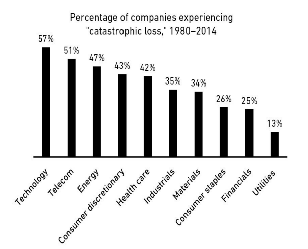

# فصل ششم: شیر یا خط، تو برنده‌ای

**می‌توانی نیمی از اوقات اشتباه کنی و باز هم ثروتی به جیب بزنی.**

> «من ۳۰ ساله دارم روی این قضیه کار می‌کنم. فکر می‌کنم ریاضیاتش ساده‌ست: بعضی پروژه‌ها می‌گیره و بعضی‌ها نه. هیچ دلیلی نداره که روی هیچ‌کدومش بیش از حد وقت تلف کنیم. فقط باید رفت سراغ پروژه بعدی.»
> — برد پیت، هنگام دریافت جایزه انجمن بازیگران سینما

هاینز برگروئن (Heinz Berggruen) در سال ۱۹۳۶ از آلمان نازی فرار کرد. او در آمریکا ساکن شد و در دانشگاه برکلی ادبیات خواند.
طبق اکثر روایت‌ها، او در جوانی استعداد خاصی از خودش نشان نداد. اما تا دهه ۱۹۹۰، برگروئن با هر معیاری که حساب کنی، یکی از موفق‌ترین دلالان آثار هنری در تمام تاریخ بود.

در سال ۲۰۰۰، برگروئن بخشی از مجموعه عظیم خودش شامل آثار پیکاسو، براک، کله و ماتیس را به قیمت بیش از ۱۰۰ میلیون یورو به دولت آلمان فروخت. این معامله آنقدر ارزان بود که آلمانی‌ها عملاً آن را یک "اهدا" تلقی کردند. ارزش این مجموعه در بازار خصوصی خیلی بیشتر از یک میلیارد دلار بود.

اینکه یک نفر بتواند چنین حجم عظیمی از شاهکارها را جمع‌آوری کند، حیرت‌انگیز است. هنر، ذهنی‌ترین و سلیقه‌ای‌ترین چیزی است که وجود دارد. چطور یک نفر توانسته در اوایل زندگی‌اش پیش‌بینی کند که چه آثاری قرار است به پرطرفدارترین کارهای قرن تبدیل شوند؟

می‌توانی بگویی «مهارت».
می‌توانی بگویی «شانس».
اما شرکت سرمایه‌گذاری Horizon Research توضیح سومی دارد. توضیحی که برای سرمایه‌گذاران بسیار مهم است.

این شرکت می‌نویسد:

> «سرمایه‌گذاران بزرگِ هنر، تعداد بسیار زیادی اثر هنری خریدند. زیرمجموعه‌ای از این کلکسیون‌ها تبدیل به سرمایه‌گذاری‌های عالی شدند و برای مدت زمان کافی نگهداری شدند تا بازدهی کل سبد سرمایه (پورتفوی) را به سمت بازدهی بهترین عناصرِ آن سبد بکشانند. کل ماجرا همین است.»

دلالان بزرگ هنری مثل "صندوق‌های شاخص" (Index Funds) عمل می‌کردند. آن‌ها هر چیزی را که می‌توانستند می‌خریدند. و آن‌ها را به صورت سبد می‌خریدند، نه تک‌قطعه‌هایی که صرفاً دوستشان داشتند. سپس می‌نشستند و منتظر می‌ماندند تا چند برنده از دل آن‌ها بیرون بیاید.
**کل ماجرا همین است.**

شاید ۹۹ درصد از آثاری که کسی مثل برگروئن در طول زندگی‌اش خرید، در نهایت ارزش چندانی پیدا نکردند. اما اگر آن ۱ درصد باقی‌مانده کارِ کسی مثل پیکاسو از آب دربیاید، آن ۹۹ درصدِ بی‌ارزش اصلاً اهمیتی ندارد. برگروئن می‌توانست در اکثر مواقع اشتباه کند و در نهایت به شکلی حیرت‌انگیز حق با او باشد (و سود کند).

خیلی از چیزها در کسب‌وک‌کار و سرمایه‌گذاری به همین شکل کار می‌کنند. **دُم‌های کشیده (Long Tails)** — یعنی دورترین انتهای نمودار توزیع نتایج — تأثیر فوق‌العاده‌ای در امور مالی دارند؛ جایی که تعداد کمی از رویدادها می‌توانند مسئولِ اکثریتِ نتایج باشند.

کنار آمدن با این موضوع سخت است، حتی اگر ریاضیاتش را بفهمید. این اصلاً شهودی (Intutitve) نیست که یک سرمایه‌گذار بتواند نیمی از اوقات اشتباه کند و همچنان ثروتمند شود. این یعنی ما دست‌کم می‌گیریم که شکست خوردنِ بسیاری از چیزها چقدر "طبیعی" است. و همین باعث می‌شود وقتی شکستی رخ می‌دهد، بیش از حد واکنش نشان دهیم.

کارتون "کشتی بخار ویلی" (Steamboat Willie) والت دیزنی را به عنوان یک انیماتور مشهور کرد. اما موفقیت تجاری داستان دیگری بود. اولین استودیوی دیزنی ورشکست شد. تولید فیلم‌هایش به شکل وحشتناکی گران بود و با شرایطی عجیب و غریب تأمین مالی می‌شد. تا اواسط دهه ۱۹۳۰، دیزنی بیش از ۴۰۰ کارتون تولید کرده بود. اکثر آن‌ها کوتاه بودند، اکثر آن‌ها توسط بینندگان دوست داشته می‌شدند، و اکثر آن‌ها ثروت زیادی را به باد دادند.

**کارتون "سفیدبرفی و هفت کوتوله" همه چیز را تغییر داد.**

۸ میلیون دلاری که این فیلم در شش ماه اول سال ۱۹۳۸ به دست آورد، از نظر بزرگی اصلاً قابل مقایسه با درآمدهای قبلی شرکت نبود. این فیلم استودیوی دیزنی را دگرگون کرد. تمام بدهی‌های شرکت پرداخت شد. کارمندان کلیدی پاداش وفاداری گرفتند. شرکت یک استودیوی جدید و فوق‌پیشرفته در بربنک خرید که هنوز هم همان‌جاست. یک جایزه اسکار، والت را از یک آدم مشهور به یک سلبریتی تمام‌عیار تبدیل کرد. تا سال ۱۹۳۸ او صدها ساعت فیلم تولید کرده بود. اما از نظر تجاری، تنها آن ۸۳ دقیقه "سفیدبرفی" بود که اهمیت داشت.

هر چیزی که عظیم، سودآور، مشهور یا تأثیرگذار است، نتیجه یک "رویداد دُمی" (Tail Event) است — یک رویدادِ یک در هزار یا یک در میلیون. و بیشتر توجه ما به سمت چیزهایی می‌رود که عظیم، سودآور، مشهور یا تأثیرگذارند. وقتی بیشترِ چیزی که به آن توجه می‌کنیم نتیجه یک "دُم" است، به راحتی فراموش می‌کنیم که آن‌ها چقدر کمیاب و قدرتمند هستند.

برخی از صنایعی که با "دُم‌ها" هدایت می‌شوند، واضح هستند. مثلاً سرمایه‌گذاری خطرپذیر (Venture Capital). اگر یک سرمایه‌گذار خطرپذیر روی ۵۰ استارتاپ سرمایه‌گذاری کند، احتمالاً انتظار دارد نیمی از آن‌ها شکست بخورند، ۱۰ تا عملکرد نسبتاً خوبی داشته باشند، و یکی دو تا تبدیل به "معدن طلا" شوند که ۱۰۰٪ بازدهی صندوق را تأمین می‌کنند.
موسسه Correlation Ventures یک بار آمارها را بررسی کرد. از بین بیش از ۲۱,۰۰۰ سرمایه‌گذاری خطرپذیر از سال ۲۰۰۴ تا ۲۰۱۴:

* ۶۵٪ پول از دست دادند.
* ۲.۵٪ از سرمایه‌گذاری‌ها ۱۰ تا ۲۰ برابر سود دادند.
* ۱٪ بیش از ۲۰ برابر سود دادند.
* نیم درصد — حدود ۱۰۰ شرکت از ۲۱,۰۰۰ تا — ۵۰ برابر یا بیشتر سود دادند. اکثرِ بازدهیِ کلِ این صنعت از همین‌جا می‌آید.

شاید فکر کنید این همان چیزی است که سرمایه‌گذاری خطرپذیر را پرریسک می‌کند. و همه می‌دانند که VC پرریسک است. اکثر استارتاپ‌ها شکست می‌خورند و دنیا فقط آن‌قدر مهربان است که اجازه دهد چند موفقیتِ مگا (Mega) شکل بگیرد.

اگر بازدهی امن‌تر، قابل پیش‌بینی‌تر و باثبات‌تری می‌خواهید، در شرکت‌های بزرگِ سهامی عام سرمایه‌گذاری می‌کنید.
یا حداقل این‌طور فکر می‌کنید.

**یادتان باشد، دُم‌ها همه چیز را هدایت می‌کنند.**

توزیع موفقیت در میان سهام شرکت‌های بزرگ عمومی در طول زمان، تفاوت چندانی با سرمایه‌گذاری خطرپذیر ندارد.
اکثر شرکت‌های عمومی عملکرد ضعیفی دارند، تعدادی خوب عمل می‌کنند، و تعداد انگشت‌شماری تبدیل به برندگان خارق‌العاده‌ای می‌شوند که اکثریتِ بازدهی بازار سهام را می‌سازند.

مدیریت دارایی جی.پی. مورگان یک بار توزیع بازدهی شاخص "راسل ۳۰۰۰" (Russell 3000) — یک مجموعه بزرگ و گسترده از شرکت‌های عمومی — را از سال ۱۹۸۰ منتشر کرد.

* ۴۰٪ از تمام شرکت‌های راسل ۳۰۰۰ حداقل ۷۰٪ ارزش خود را از دست دادند و هرگز در این دوره بهبود نیافتند.
* عملاً تمامِ بازدهیِ کلیِ شاخص از **۷٪** شرکت‌هایی ناشی می‌شد که عملکردشان حداقل دو انحراف معیار بهتر از میانگین بود.

این آماری است که از سرمایه‌گذاری خطرپذیر انتظار دارید. اما این اتفاقی است که در یک شاخصِ بورسیِ خسته‌کننده و متنوع رخ داده است.

 

نکته جالب اینجاست که برای تبدیل شدن به یک شرکت عمومی و عضویت در راسل ۳۰۰۰، باید به سطح خاصی از موفقیت رسیده باشید. این‌ها شرکت‌های جاافتاده هستند، نه استارتاپ‌های بی‌نام و نشان. با این حال، عمر اکثر آن‌ها با سال اندازه گرفته می‌شود، نه نسل.

بیایید مثال یکی از این شرکت‌ها را ببینیم: Carolco، عضو سابق شاخص راسل ۳۰۰۰.
این شرکت برخی از بزرگترین فیلم‌های دهه ۸۰ و ۹۰ را تولید کرد، از جمله سه فیلم اول "رمبو"، "ترمیناتور ۲"، "غریزه اصلی" و "یادآوری کامل".
کارولکو در سال ۱۹۸۷ عمومی شد. موفقیت عظیمی بود و پشت سر هم فیلم‌های پرفروش می‌ساخت. در سال ۱۹۹۱ نیم میلیارد دلار درآمد داشت و ارزش بازارش ۴۰۰ میلیون دلار بود — پول زیادی در آن زمان، مخصوصاً برای یک استودیوی فیلمسازی.
و بعد شکست خورد.
فیلم‌های پرفروش متوقف شدند، چند پروژه پرهزینه شکست خوردند و تا اواسط دهه ۹۰ کارولکو به تاریخ پیوست. در سال ۱۹۹۶ ورشکست شد. سهام به صفر رسید، روز خوش. یک ضرر فاجعه‌بار. و ضرری که ۴ شرکت از هر ۱۰ شرکت عمومی به مرور زمان تجربه می‌کنند. داستان کارولکو ارزش گفتن دارد نه به خاطر اینکه منحصر‌به‌فرد است، بلکه چون **رایج** است.

این مهم‌ترین بخش داستان است: شاخص راسل ۳۰۰۰ از سال ۱۹۸۰ بیش از ۷۳ برابر رشد کرده است. این یک بازدهی تماشایی است. این یعنی موفقیت.
۴۰ درصد از شرکت‌های این شاخص عملاً شکست خوردند. اما آن ۷ درصدی که عملکردی فوق‌العاده داشتند، بیش از حدِ کافی بودند تا آن بازنده‌ها را جبران کنند. درست مثل هاینز برگروئن، اما این بار با مایکروسافت و والمارت به جای پیکاسو و ماتیس.

ایده‌ای که می‌گوید «چند چیزِ معدود مسئولِ اکثرِ نتایج هستند» فقط در مورد شرکت‌های پورتفوی سرمایه‌گذاری شما صدق نمی‌کند. این همچنین بخش مهمی از رفتار خود شما به عنوان یک سرمایه‌گذار است.

تعریف ناپلئون از یک نابغه نظامی این بود: **«مردی که بتواند کارِ معمولی را انجام دهد، وقتی همه اطرافیانش دارند دیوانه می‌شوند.»**
در سرمایه‌گذاری هم همین‌طور است.

بیشتر توصیه‌های مالی مربوط به "امروز" است. الان باید چه کار کنی؟ امروز چه سهامی برای خرید خوب است؟
اما بیشترِ اوقات، "امروز" آن‌قدرها هم مهم نیست. در طول عمر سرمایه‌گذاری شما، تصمیماتی که امروز یا فردا یا هفته بعد می‌گیرید، به اندازه کاری که در تعداد کمی از روزها انجام می‌دهید اهمیت نخواهد داشت — احتمالاً ۱٪ از زمان یا کمتر — یعنی روزهایی که همه اطرافیان شما دارند دیوانه می‌شوند.

تصور کنید اگر از سال ۱۹۰۰ تا ۲۰۱۹ ماهیانه ۱ دلار پس‌انداز می‌کردید چه می‌شد.
می‌توانستید آن ۱ دلار را هر ماه در بازار سهام آمریکا سرمایه‌گذاری کنید، چه هوا آفتابی باشد چه طوفانی. مهم نیست اقتصاددانان درباره رکود قریب‌الوقوع یا بازار خرسی جدید فریاد بزنند. شما فقط به سرمایه‌گذاری ادامه می‌دهید.
بیایید اسم سرمایه‌گذاری که این کار را می‌کند بگذاریم **سو (Sue)**.

اما شاید سرمایه‌گذاری در دوران رکود خیلی ترسناک باشد. پس شاید شما ۱ دلار خود را وقتی اقتصاد در رکود نیست در بورس سرمایه‌گذاری کنید، وقتی وارد رکود شد همه چیز را بفروشید و دلار ماهانه را نقد نگه دارید، و وقتی رکود تمام شد دوباره همه را وارد بورس کنید. اسم این سرمایه‌گذار را می‌گذاریم **جیم (Jim)**.

یا شاید چند ماه طول می‌کشد تا رکود شما را بترساند و خارج شوید، و بعد مدتی طول می‌کشد تا اعتماد به نفس پیدا کنید و برگردید. شما وقتی رکود نیست سرمایه‌گذاری می‌کنید، شش ماه بعد از شروع رکود می‌فروشید و شش ماه بعد از پایان رکود دوباره برمی‌گردید. اسم شما را می‌گذاریم **تام (Tom)**.

این سه سرمایه‌گذار در طول زمان چقدر پول خواهند داشت؟

* سو: ۴۳۵,۵۵۱ دلار
* جیم: ۲۵۷,۳۸۶ دلار
* تام: ۲۳۴,۴۷۶ دلار

**سو با اختلاف برنده می‌شود.**
بین سال‌های ۱۹۰۰ تا ۲۰۱۹، ۱۴۲۸ ماه وجود داشت. فقط حدود ۳۰۰ ماه از آن‌ها در دوران رکود بود. پس با حفظ خونسردی در تنها ۲۲٪ از زمانی که اقتصاد در رکود یا نزدیک به آن بود، سو تقریباً سه چهارم پول بیشتری نسبت به جیم یا تام به دست می‌آورد.

مثال جدیدتر: رفتار شما به عنوان سرمایه‌گذار در چند ماه اواخر ۲۰۰۸ و اوایل ۲۰۰۹ احتمالاً تأثیر بیشتری بر بازدهی کل زندگی‌تان داشته تا هر کاری که از سال ۲۰۰۰ تا ۲۰۰۸ انجام دادید.

خلبان‌ها شوخی قدیمی‌ای دارند که شغلشان این است: «ساعت‌ها و ساعت‌ها کسالت، که با لحظاتی از وحشتِ خالص قطع می‌شود.» سرمایه‌گذاری هم همین است. موفقیت شما با نحوه پاسخگویی‌تان به آن لحظاتِ مقطعیِ وحشت تعیین می‌شود، نه سال‌هایی که روی حالت کروز کنترل (خلبان خودکار) بودید.

یک تعریف خوب از نابغه سرمایه‌گذاری، مرد یا زنی است که بتواند کارِ معمولی را انجام دهد، وقتی همه اطرافیانش دارند دیوانه می‌شوند.

**دُم‌ها همه چیز را هدایت می‌کنند.**

وقتی بپذیرید که دُم‌ها (رویدادهای کمیاب) همه چیز را در کسب‌وک‌کار، سرمایه‌گذاری و امور مالی هدایت می‌کنند، متوجه می‌شوید که طبیعی است بسیاری از چیزها خراب شوند، بشکنند، شکست بخورند و سقوط کنند.

* اگر یک انتخاب‌گرِ سهامِ خوب باشید، شاید نیمی از اوقات حق با شما باشد.
* اگر یک رهبر کسب‌وک‌کار خوب باشید، شاید نیمی از ایده‌های محصول و استراتژی‌تان جواب بدهد.
* اگر سرمایه‌گذار خوبی باشید، اکثر سال‌ها فقط "ای بدک نیست" خواهد بود و خیلی از سال‌ها "بد".
* اگر کارمند خوبی باشید، بعد از چندین تلاش و امتحان، شرکت مناسب در حوزه مناسب را پیدا خواهید کرد.

و این در صورتی است که شما "خوب" باشید.
پیتر لینچ یکی از بهترین سرمایه‌گذاران زمان ماست. او یک بار گفت: «اگر در این بیزنس محشر باشید، ۶ بار از ۱۰ بار حق با شماست.»

رشته‌هایی هستند که باید هر بار بی‌نقص باشید. مثلاً خلبانی هواپیما. رشته‌هایی هم هستند که می‌خواهید تقریباً همیشه دست‌کم "خیلی خوب" باشید. مثلاً سرآشپز رستوران.
سرمایه‌گذاری، کسب‌وک‌کار و امور مالی اصلاً شبیه این رشته‌ها نیستند.

چیزی که من هم از سرمایه‌گذاران و هم از کارآفرینان یاد گرفته‌ام این است که هیچ‌کس همیشه تصمیمات درست نمی‌گیرد. تحسین‌برانگیزترین افراد پُر از ایده‌های وحشتناکی هستند که اغلب به آن‌ها عمل هم کرده‌اند.

آمازون را در نظر بگیرید. شهودی نیست که فکر کنیم شکستِ یک محصول در یک شرکت بزرگ، طبیعی و بلامانع است. به طور شهودی فکر می‌کنید مدیرعامل باید از سهامداران عذرخواهی کند. اما جف بزوس، مدیرعامل، مدت کوتاهی پس از عرضه فاجعه‌بار "تلفن فایر" (Fire Phone) گفت:

> «اگر فکر می‌کنید این شکست بزرگی است، ما الان داریم روی شکست‌های خیلی بزرگتری کار می‌کنیم. شوخی نمی‌کنم. بعضی از آن‌ها کاری می‌کنند که فایر فون مثل یک نقطه کوچک به نظر برسد.»

برای آمازون اشکالی ندارد که پول زیادی سرِ فایر فون از دست بدهد، چون با چیزی مثل "آمازون وب سرویس" (AWS) که ده‌ها میلیارد دلار درآمد دارد جبران می‌شود. دُم‌ها به نجات می‌آیند.

کریس راکی که من در تلویزیون می‌بینم، خنده‌دار و بی‌نقص است. کریس راکی که هر سال در ده‌ها کلوب کوچک اجرا می‌کند، "فقط خوب" است. و این از روی قصد و طراحی است. هیچ نابغه کمدی‌ای آنقدر باهوش نیست که پیشاپیش بداند چه جوک‌هایی می‌گیرند. هر کمدین بزرگی مطالبش را در کلوب‌های کوچک تست می‌کند قبل از اینکه در سالن‌های بزرگ اجرا کند.

یک بار از راک پرسیدند آیا دلش برای کلوب‌های کوچک تنگ شده؟ او پاسخ داد:

> «وقتی تور را شروع می‌کنم، اینطور نیست که از استادیوم‌ها شروع کنم. قبل از تور آخر، در جایی در نیوبرانزویک به نام "کارخانه استرس" اجرا کردم. حدود ۴۰ یا ۵۰ اجرا داشتم تا برای تور آماده شوم.»

یک روزنامه گزارشی از این جلسات کلوب‌های کوچک نوشت. توصیف کرد که راک ورق‌های یادداشتش را زیر و رو می‌کرد و با مطالب کلنجار می‌رفت. وسط اجرا می‌گفت: «باید بعضی از این جوک‌ها را حذف کنم.» جوک‌های خوبی که من در نتفلیکس می‌بینم، همان "دُم‌هایی" هستند که از میان دنیایی از صدها تلاش بیرون زده‌اند.

اتفاق مشابهی در سرمایه‌گذاری می‌افتد. پیدا کردن دارایی خالص وارن بافت یا میانگین بازده سالانه‌اش آسان است. یا حتی بهترین و مشهورترین سرمایه‌گذاری‌هایش. آن‌ها جلوی چشم هستند و مردم درباره‌شان حرف می‌زنند.
خیلی سخت‌تر است که تک‌تک سرمایه‌گذاری‌هایی را که در طول حرفه‌اش انجام داده کنار هم بگذارید. هیچ‌کس درباره انتخاب‌های شکست‌خورده، کسب‌وک‌کارهای زشت و خریدهای ضعیف حرف نمی‌زند. اما آن‌ها بخش بزرگی از داستان بافت هستند. آن‌ها روی دیگرِ بازدهیِ مبتنی بر دُم هستند.

در جلسه سهامداران برکشایر هاتاوی در سال ۲۰۱۳، وارن بافت گفت که در طول زندگی‌اش مالک ۴۰۰ تا ۵۰۰ سهام بوده و اکثر پولش را روی ۱۰ تا از آن‌ها به دست آورده است. چارلی مانگر ادامه داد: **«اگر فقط چند مورد از سرمایه‌گذاری‌های برتر برکشایر را حذف کنید، سابقه بلندمدت آن کاملاً معمولی است.»**

وقتی توجه ویژه‌ای به موفقیت‌های یک الگو می‌کنیم، نادیده می‌گیریم که دستاوردهای آن‌ها فقط از درصد کوچکی از اقداماتشان ناشی شده است. این باعث می‌شود شکست‌ها، ضررها و عقب‌گرد‌های خودمان حسِ "اشتباه کردن" به ما بدهند. اما ممکن است ما هم به اندازه اساتید، اشتباه کنیم یا فقط "تا حدی" درست بگوییم. آن‌ها شاید وقتی حق با آن‌ها بود، "بیشتر" حق با آن‌ها بود (سود بیشتری بردند)، اما می‌توانستند دقیقاً به اندازه شما اشتباه کرده باشند.

جورج سوروس یک بار گفت: **«مهم نیست حق با توست یا اشتباه می‌کنی، مهم این است که وقتی حق با توست چقدر پول در می‌آوری و وقتی اشتباه می‌کنی چقدر از دست می‌دهی.»**
می‌توانی نیمی از اوقات اشتباه کنی و باز هم ثروتی به جیب بزنی.

در کهکشان ما ۱۰۰ میلیارد سیاره وجود دارد و تا جایی که می‌دانیم، فقط یکی حیات هوشمند دارد.
واقعیت اینکه شما دارید این کتاب را می‌خوانید، نتیجه طولانی‌ترین "دُمی" است که می‌توانید تصور کنید.
این چیزی است که باید بابتش خوشحال باشید. در ادامه، بیایید ببینیم پول چطور می‌تواند شما را حتی خوشحال‌تر کند.
