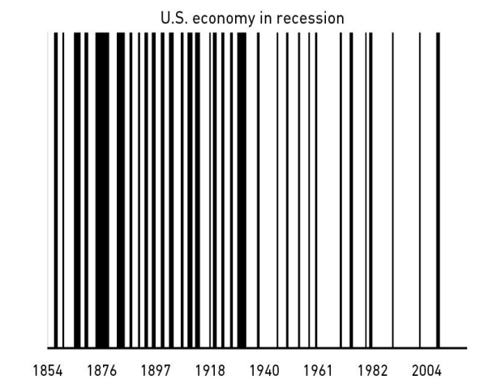

# فصل دوازدهم: غافلگیری

تاریخ مطالعه‌ی تغییرات است؛ به طرزی متناقض، به عنوان نقشه‌ای برای آینده مورد استفاده قرار می‌گیرد.

استاد دانشگاه استنفورد، اسکات ساگان، یک‌بار جمله‌ای گفت که هر کسی اقتصاد یا بازارهای سرمایه را دنبال می‌کند، باید آن را روی دیوارش نصب کند: «چیزهایی که هرگز اتفاق نیفتاده‌اند، تمام وقت اتفاق می‌افتند.» تاریخ عمدتاً مطالعه‌ی وقایع پیش‌بینی‌نشده است. اما اغلب توسط سرمایه‌گذاران و اقتصاددانان به عنوان راهنمایی لغزناپذیر برای آینده استفاده می‌شود. آیا این تناقض را می‌بینید؟ آیا مشکل را می‌بینید؟ داشتن درک عمیقی از تاریخ اقتصاد و سرمایه‌گذاری امری هوشمندانه است. تاریخ به ما کمک می‌کند انتظاراتمان را تنظیم کنیم، بررسی کنیم که مردم معمولاً در کجا اشتباه می‌کنند، و راهنمای تقریبی از آنچه معمولاً جواب می‌دهد به ما ارائه دهد. اما به هیچ وجه نقشه‌ی آینده نیست.

تله‌ای که بسیاری از سرمایه‌گذاران در آن می‌افتند، آن چیزی است که من آن را مغالطه‌ی «تاریخ‌دانان به‌عنوان پیامبر» می‌نامم: اتکای بیش‌ازحد به داده‌های گذشته به‌عنوان نشانه‌ای از شرایط آینده در حوزه‌ای که نوآوری و تغییر، خونِ حیاتِ پیشرفت هستند. نمی‌توان سرمایه‌گذاران را سرزنش کرد که این کار را می‌کنند. اگر به سرمایه‌گذاری به‌عنوان یک علمِ سخت نگاه کنید، تاریخ باید راهنمای کاملی برای آینده باشد. زمین‌شناسان می‌توانند به یک میلیارد سال داده‌ی تاریخی نگاه کنند و مدل‌هایی از نحوه‌ی عملکرد زمین تشکیل دهند. هواشناسان هم می‌توانند. و پزشکان هم — کلیه‌ها در سال ۲۰۲۰ به همان شکلی کار می‌کنند که در سال ۱۰۲۰ کار می‌کردند. اما سرمایه‌گذاری یک علمِ سخت نیست. این داستانِ گروه عظیمی از مردم است که با اطلاعات محدود، در مورد چیزهایی که تأثیر عظیمی بر رفاهشان دارد، تصمیمات ناقص می‌گیرند؛ و این موضوع می‌تواند حتی افراد باهوش را عصبی، طماع و پارانوید کند.

ریچارد فاینمن، فیزیکدان بزرگ، یک‌بار گفت: «تصور کنید فیزیک چقدر سخت‌تر می‌بود اگر الکترون‌ها احساس داشتند.» خب، سرمایه‌گذاران احساس دارند. احساساتِ زیادی دارند. به همین دلیل است که پیش‌بینی اینکه بعداً چه کاری خواهند کرد، صرفاً بر اساس آنچه در گذشته انجام داده‌اند، دشوار است. رکن اصلی اقتصاد این است که اوضاع با گذشت زمان تغییر می‌کنند، زیرا دست نامرئی از هر چیزی که برای مدت طولانی خیلی خوب یا خیلی بد باشد متنفر است. سرمایه‌گذار بیل بونر یک‌بار توضیح داد که آقای بازار چگونه کار می‌کند: «او یک تی‌شرت با پیراهن "سرمایه‌داری در حال کار" پوشیده و در دستش یک چکش سنگین دارد.»

چیزهای کمی برای مدت طولانی ثابت می‌مانند، به این معنی که ما نمی‌توانیم با تاریخ‌دانان مانند پیامبران برخورد کنیم. مهم‌ترین محرک هر چیزی که به پول گره خورده، داستان‌هایی است که مردم برای خودشان تعریف می‌کنند و ترجیحاتی که برای کالاها و خدمات دارند. این چیزها تمایلی به سکون ندارند. آن‌ها با فرهنگ و نسل تغییر می‌کنند. آن‌ها همیشه در حال تغییر هستند و همیشه خواهند بود.

حیله‌ی ذهنی که اینجا بر خودمان روا می‌داریم، تحسین بیش‌ازحد کسانی است که در زمینه‌ی پول، آنجا بوده‌اند و آن کار را انجام داده‌اند. تجربه‌ی وقایع خاص، لزوماً واجد شرایط شما نمی‌کند تا بدانید بعداً چه اتفاقی خواهد افتاد. در واقع به ندرت این‌طور است، زیرا تجربه بیشتر از پیش‌بینی‌پذیری، منجر به اعتماد‌به‌نفسِ بیش‌ازحد می‌شود. سرمایه‌گذار مایکل باتنیک یک‌بار این موضوع را به خوبی توضیح داد. با استدلال مواجه شد که سرمایه‌گذاران کمی برای افزایش نرخ بهره آماده هستند زیرا هرگز چنین تجربه‌ای نداشته‌اند — آخرین دوره‌ی بزرگ افزایش نرخ بهره تقریباً ۴۰ سال پیش رخ داده بود — او استدلال کرد که این مهم نیست، زیرا تجربه یا حتی مطالعه‌ی آنچه در گذشته اتفاق افتاده، ممکن است راهنمایی برای آنچه در آینده هنگام افزایش نرخ‌ها رخ می‌دهد، نباشد:

«پس چه؟ آیا افزایش نرخ فعلی شبیه به آخرین مورد خواهد بود، یا موردی قبل از آن؟ آیا طبقات مختلف دارایی رفتار مشابه، یکسان، یا دقیقاً متضاد خواهند داشت؟ از یک سو، افرادی که از طریق وقایع ۱۹۸۷، ۲۰۰۰ و ۲۰۰۸ سرمایه‌گذاری کرده‌اند، طیف وسیعی از بازارهای مختلف را تجربه کرده‌اند. از سوی دیگر، آیا این امکان وجود ندارد که این تجربه منجر به اعتماد‌به‌نفسِ بیش‌ازحد شود؟ شکست در پذیرش اشتباه بودن؟ لنگر انداختن به نتایج قبلی؟»

دو خطرِ خطرناک زمانی رخ می‌دهد که بیش از حد به تاریخ سرمایه‌گذاری به عنوان راهنمای آنچه قرار است اتفاق بیفتد تکیه می‌کنید:

۱. احتمالاً وقایع پرت (Outlier) را که بیشترین تأثیر را دارند، از دست می‌دهید.
مهم‌ترین رویدادها در داده‌های تاریخی، پرت‌های بزرگ، رکوردشکن‌ها هستند. آن‌ها چیزهایی هستند که عقربه‌ها را در اقتصاد و بازار سهام حرکت می‌دهند. رکود بزرگ. جنگ جهانی دوم. حباب دات-کام. ۱۱ سپتامبر. سقوط بازار مسکن اواسط دهه ۲۰۰۰. تعداد انگشت‌شماری از وقایع پرت نقش بسیار بزرگی ایفا می‌کنند زیرا بر بسیاری از رویدادهای نامرتبط پس از خود تأثیر می‌گذارند. پانزده میلیارد نفر در قرن نوزدهم و بیستم متولد شدند. اما سعی کنید تصور کنید اقتصاد جهانی — و کل جهان — چقدر متفاوت می‌بود اگر فقط هفت نفر از آن‌ها هرگز وجود نمی‌داشتند:

آدولف هیتلر
ژوزف استالین
ماو تسه‌تونگ
گاوریلو پرینسیپ
توماس ادیسون
بیل گیتس
مارتین لوتر کینگ

حتی مطمئن نیستم که این معنادارترین فهرست باشد. اما تقریباً هر چیزی در مورد جهان امروز — از مرزها گرفته تا فناوری و هنجارهای اجتماعی — متفاوت بود اگر این هفت نفر اثر خود را بر جای نمی‌گذاشتند. راه دیگر برای بیان این مطلب این است که ۰.۰۰۰۰۰۰۰۰۰۰۴ درصد از مردم مسئول شاید اکثریت جهت جهان در قرن گذشته بوده‌اند. همین مطلب در مورد پروژه‌ها، نوآوری‌ها و رویدادها نیز صدق می‌کند. قرن گذشته را بدون این‌ها تصور کنید:

رکود بزرگ
جنگ جهانی دوم
پروژه‌ی منهتن
واکسن‌ها
آنتی‌بیوتیک‌ها
آرانت (ARPANET)
۱۱ سپتامبر
سقوط اتحاد جماهیر شوروی

چند پروژه و رویداد در قرن بیستم رخ داد؟ میلیاردها، تریلیون‌ها — چه می‌دانم. اما آن هشت مورد به تنهایی بر جهان به مراتب بیشتر از سایرین تأثیر گذاشتند. چیزی که باعث می‌شود رویدادهای دُمی (Tail events) به راحتی نادیده گرفته شوند، سهولت دست‌کم گرفتن این است که چگونه امور به صورت مرکب رشد می‌کنند. برای مثال، چگونه ۱۱ سپتامبر باعث فدرال رزرو شد نرخ بهره را کاهش دهد، که به ایجاد حباب مسکن کمک کرد، که منجر به بحران مالی شد، که منجر به بازار کار ضعیف شد، که منجر شد ده‌ها میلیون نفر به دنبال تحصیلات دانشگاهی بروند، که منجر شد به ۱.۶ تریلیون دلار وام دانشجویی با نرخ نکول ۱۰.۸٪.

لینک کردن ۱۹ hijacker به وزن فعلی وام‌های دانشجویی شهودی نیست، اما این چیزی است که در جهانی که توسط تعداد کمی رویداد پرتِ دُمی هدایت می‌شود، رخ می‌دهد. اکثریت آنچه در هر لحظه معین در اقتصاد جهانی رخ می‌دهد، قابل ردیابی به تعداد انگشت‌شماری از رویدادهای گذشته است که پیش‌بینی آن‌ها تقریباً غیرممکن بود. رایج‌ترین خط داستانی تاریخ اقتصاد، نقش غافلگیری‌هاست. دلیل اینکه غافلگیری‌ها رخ می‌دهند این نیست که مدل‌های ما غلط هستند یا هوش ما کم است. این است که احتمال اینکه والدین آدولف هیتلر در شبانی که نه ماه قبل از تولدش بود بحث کردند، همان قدر بود که بچه‌دار شدنشان. پیش‌بینی فناوری دشوار است زیرا بیل گیتس ممکن بود به دلیل فلج اطفال می‌مرد اگر جوناس سالک عصبانی می‌شد و تلاشش برای پیدا کردن واکسن را رها می‌کرد. دلیل اینکه نتوانستیم رشد وام‌های دانشجویی را پیش‌بینی کنیم این است که یک محافظ امنیت فرودگاه ممکن بود در ۱۱ سپتامبر چاقشوی یک hijacker را ضبط می‌کرد. همین و بس.

مشکل این است که ما اغلب از رویدادهایی مانند رکود بزرگ و جنگ جهانی دوم برای هدایت دیدگاه‌هایمان در مورد سناریوهای بدبینانه هنگام فکر کردن به بازدهی آینده استفاده می‌کنیم. اما آن رویدادهای رکوردشکن در زمان وقوع سابقه‌ای نداشتند. بنابراین پیش‌بینی‌کننده‌ای که فرض می‌کند بدترین (و بهترین) رویدادهای گذشته با بدترین (و بهترین) رویدادهای آینده برابر خواهد بود، تاریخ را دنبال نمی‌کند؛ او به طور ناخواسته فرض می‌کند که تاریخِ رویدادهای بی‌سابقه شامل آینده نمی‌شود.

ناسمیم طالب در کتاب خود *با احتمالات فریب خورده‌ایم* می‌نویسد:
«در مصر فرعونی... منشیان نشان بالاترین سطح آب نیل را ثبت می‌کردند و آن را به‌عنوان برآوردی از سناریوی بدبینانه‌ی آینده استفاده می‌کردند. همین را می‌توان در راکتور هسته‌ای فوکوشیما دید که در سال ۲۰۱۱ زمانی که یک سونامی به آن اصابت کرد، دچار شکست فاجعه‌بار شد. این راکتور برای مقاومت در برابر بدترین زمین‌لرزه‌ی تاریخی گذشته ساخته شده بود، و سازندگان تصور نمی‌کردند که چیزی بسیار بدتر ممکن است رخ دهد — و فکر نمی‌کردند که بدترین رویداد گذشته باید یک غافلگیری باشد، زیرا سابقه‌ای نداشت.»

این یک شکستِ تحلیل نیست. این یک شکستِ تخیل است. درک اینکه آینده ممکن است هیچ شباهتی به گذشته نداشته باشد، مهارت ویژه‌ای است که توسط جامعه‌ی پیش‌بینی مالی معمولاً تحسین نمی‌شود. در یک شام در سال ۲۰۱۷ که در نیویورک شرکت کردم، از دانیل کاهنمان پرسیده شد که سرمایه‌گذاران چگونه باید پاسخ دهند وقتی پیش‌بینی‌های ما غلط از آب در می‌آید. او گفت:
«هر زمان توسط چیزی غافلگیر می‌شویم، حتی اگر اقرار کنیم که اشتباه کردیم، می‌گوییم، "آه، دیگر هرگز آن اشتباه را نمی‌کنم." اما، در واقع، آنچه باید یاد بگیرید وقتی اشتباهی می‌کنید زیرا چیزی را پیش‌بینی نکرده‌اید، این است که جهان پیش‌بینی کردنش دشوار است. این درس صحیحی است که باید از غافلگیری‌ها آموخت: اینکه جهان غافلگیرکننده است. درس صحیحی که باید از غافلگیری‌ها آموخت این است که جهان غافلگیرکننده است. نه اینکه ما باید از غافلگیری‌های گذشته به‌عنوان راهنمایی برای مرزهای آینده استفاده کنیم؛ بلکه باید از غافلگیری‌های گذشته به‌عنوان اقراری به این事实 استفاده کنیم که هیچ ایده‌ای نداریم بعداً چه ممکن است رخ دهد.»

مهم‌ترین رویدادهای اقتصادی آینده — چیزهایی که بیشترین تأثیر را خواهند داشت — چیزهایی هستند که تاریخ ما راهنمای کمی یا هیچ راهنمایی درباره‌ی آن‌ها نمی‌دهد. آن‌ها رویدادهای بی‌سابقه‌ای خواهند بود. ماهیت بی‌سابقه‌ی آن‌ها به این معنی است که ما برای آن‌ها آماده نخواهیم بود، که بخشی از چیزهایی است که آن‌ها را این‌قدر تأثیرگذار می‌کند. این هم در مورد رویدادهای ترسناک مانند رکودها و جنگ‌ها و هم در مورد رویدادهای بزرگ مانند نوآوری صادق است. من به آن پیش‌بینی اطمینان دارم زیرا غافلگیری‌هایی که بیشترین تأثیر را دارند، یک پیش‌بینی است که در تقریباً هر نقطه‌ای از تاریخ دقیق بوده است.

۲. تاریخ می‌تواند راهنمای گمراه‌کننده‌ای برای آینده‌ی اقتصاد و بازار سهام باشد زیرا تغییرات ساختاری مرتبط با جهان امروز را در نظر نمی‌گیرد. به چند مورد بزرگ فکر کنید.

طرح ۴۰۱(کا) ۴۲ سال قدمت دارد. طرح راث IRA جوان‌تر است و در دهه ۱۹۹۰ ایجاد شد. بنابراین مشاوره و تحلیل مالی شخصی در مورد اینکه آمریکایی‌ها امروز چگونه برای بازنشستگی پس‌انداز می‌کنند، مستقیماً قابل مقایسه با آنچه تنها یک نسل قبل منطقی بود، نیست. گزینه‌های جدیدی داریم. اوضاع تغییر کرده است.

یا سرمایه‌گذاری خطرپذیر (Venture Capital) را در نظر بگیرید. ۲۵ سال پیش به سختی وجود داشت. امروز صندوق‌های سرمایه‌گذاری خطرپذیرِ تکی وجود دارند که بزرگتر از کل این صنعت یک نسل پیش هستند. در خاطرات خود، فیل نایت، بنیان‌گذار نایک، در مورد روزهای اولیه‌اش در کسب‌وکار نوشت:
«چیزی به نام سرمایه‌گذاری خطرپذیر وجود نداشت. یک کارآفرین جویای نام بسیارfew جا برای مراجعه داشت، و آن جاهای همه توسط دروازه‌بانانِ گریزپذیر (risk-averse) با تخیل صفر نگهبانی می‌شد. به بیان دیگر، بانکداران.»

آنچه این در عمل به آن معناست این است که تمام داده‌های تاریخی که تنها به چند دهه قبل برمی‌گردند، در مورد اینکه استارتاپ‌ها چگونه تأمین مالی می‌شوند، منسوخ شده است. آنچه در مورد چرخه‌های سرمایه‌گذاری و نرخ‌های شکست استارتاپ‌ها می‌دانیم، پایه عمیقی از تاریخ برای یادگیری نیست، زیرا نحوه تأمین مالی شرکت‌ها امروز یک پارادایم تاریخی جدید است.

یا بازارهای عمومی را در نظر بگیرید. شاخص S&P ۵۰۰ تا سال ۱۹۷۶ شامل سهام مالی نبود؛ امروز، بخش مالی ۱۶ درصد از شاخص را تشکیل می‌دهد. سهام فناوری ۵۰ سال پیش عملاً وجود نداشت. امروز، بیش از یک‌پنجم شاخص هستند. قوانین حسابداری با گذشت زمان تغییر کرده‌اند. افشای اطلاعات، حسابرسی و میزان نقدینگی بازار هم همینطور. اوضاع تغییر کرده است.

فاصله زمانی بین رکودهای اقتصادی در ایالات متحده در ۱۵۰ سال اخیر به شدت تغییر کرده است:

 

میانگین فاصله زمانی بین رکودها از حدود دو سال در اواخر دهه ۱۸۰۰ به پنج سال در اوایل قرن بیستم و به هشت سال در نیمه‌ی اخیر افزایش یافته است.

در زمانی که این را می‌نویسم، به نظر می‌رسد ما در حال ورود به رکود هستیم — ۱۲ سال از زمانی که آخرین رکود در دسامبر ۲۰۰۷ آغاز شد، می‌گذرد. این طولانی‌ترین فاصله بین رکودها از قبل از جنگ داخلی تاکنون است.

نظریه‌های زیادی در مورد اینکه چرا رکودها کمتر شده‌اند وجود دارد. یکی این است که فدرال رزرو در مدیریت چرخه‌ی تجاری بهتر است، یا حداقل در طولانی‌کردن آن. دیگری این است که صنعت سنگین بیشتر از صنایع خدماتی که در ۵۰ سال اخیر مسلط بوده‌اند، مستعد تولید بیش از حد و رونق و رکود (boom-and-bust) است. دیدگاه بدبینانه این است که ما اکنون رکودهای کمتری داریم، اما وقتی رخ می‌دهند، قدرتمندتر از قبل هستند. برای بحث ما مهم نیست چه چیزی باعث این تغییر شده است. مهم این است که اوضاع به وضوح تغییر کرده است.

برای نشان دادن اینکه این تغییرات تاریخی چگونه باید بر تصمیمات سرمایه‌گذاری تأثیر بگذارند، به کار مردی نگاه کنید که بسیاری او را یکی از بزرگترین ذهن‌های سرمایه‌گذاری تمام ادوار می‌دانند: بنیامین گراهام.

کتاب کلاسیک گراهام، *سرمایه‌گذار هوشمند*، بیش از تئوری است. دستورالعمل‌های عملی مانند فرمول‌هایی ارائه می‌دهد که سرمایه‌گذاران می‌توانند برای گرفتن تصمیمات سرمایه‌گذاری هوشمندانه از آن‌ها استفاده کنند.

من کتاب گراهام را وقتی نوجوان بودم و برای اولین بار در حال یادگیری درباره‌ی سرمایه‌گذاری بودم، خواندم. فرمول‌های ارائه شده در کتاب برای من جذاب بودند، زیرا به معنای واقعی کلمه دستورالعمل‌های گام‌به‌گام برای ثروتمند شدن بودند. فقط دستورالعمل‌ها را دنبال کنید. چقدر آسان به نظر می‌رسید.

اما وقتی سعی می‌کنید برخی از این فرمول‌ها را اعمال کنید، چیزی آشکار می‌شود: کمتر از آن‌ها واقعاً جواب می‌دهند.

گراهام پیشنهاد می‌کرد سهامی را خریداری کنید که کمتر از خالص دارایی‌های جاری خود معامله می‌شوند — که در اصل همان پول نقد بانک منهای تمام بدهی‌هاست. این عالی به نظر می‌رسد، اما دیگر کمتر سهامی با این ارزانی معامله می‌شود — مگر شاید سهامی پنی (penny stock) که متهم به تقلب حسابداری شده باشد.

یکی از معیارهای گراهام به سرمایه‌گذاران محافظه‌کار دستور می‌دهد از سهامی که بیش از ۱.۵ برابر ارزش دفتری (Book Value) معامله می‌شوند، اجتناب کنند. اگر شما در دهه‌ی گذشته این قانون را دنبال می‌کردید، تقریباً هیچ‌چیز به جز سهام بیمه و بانک نداشتید. هیچ جهانی وجود ندارد که این اوکی باشد.

*سرمایه‌گذار هوشمند* یکی از بزرگترین کتاب‌های سرمایه‌گذاری تمام ادوار است. اما من سرمایه‌گذار single ای نمی‌شناسم که با پیاده‌سازی فرمول‌های منتشر شده‌ی گراهام عملکرد خوبی داشته باشد. این کتاب مملو از خرد است — شاید بیشتر از هر کتاب سرمایه‌گذاری دیگری که تاکنون منتشر شده است. اما به عنوان یک راهنمای عملی (How-to)، در بهترین حالت مورد تردید است.

چه اتفاقی افتاد؟ آیا گراهام یک نمایش‌دهنده بود که حرف‌هایش خوب به نظر می‌رسید اما نصیحت‌هایش جواب نمی‌داد؟ اصلاً. خود او یک سرمایه‌گذار بی‌نظیر و موفقی بود.

اما او عمل‌گرا بود. و او یک مخالف واقعی (contrarian) بود. او چنان به ایده‌های سرمایه‌گذاری وابسته نبود که وقتی سرمایه‌گذاران بسیار دیگری نیز به آن‌ نظرات پی می‌بردند و آن‌ها را تا حدی محبوب می‌کردند که پتانسیلشان را بی‌فایده می‌کرد، همچنان به آن‌ها پایبند بماند. جیسون زویگ — که نسخه‌ی بعدتری از کتاب گراهام را حاشیه‌نویسی کرد — یک‌بار نوشت:

«گراهام به طور مداوم در حال آزمایش و بازآزمایی فرضیاتش و جستجو برای آنچه کار می‌کند بود — نه آنچه دیروز کار می‌کرد بلکه آنچه امروز کار می‌کند. در هر ویرایش اصلاح شده‌ی *سرمایه‌گذار هوشمند*، گراهام فرمول‌هایی را که در ویرایش قبلی ارائه کرده بود کنار می‌گذاشت و آن‌ها را با فرمول‌های جدید جایگزین می‌کرد و در واقع اعلام می‌کرد که "دیگر کار نمی‌کنند، یا آنطور که قبلاً کار نمی‌کنند؛ این‌ها فرمول‌هایی هستند که در حال حاضر بهتر به نظر می‌رسند."»

یکی از انتقادهای رایج از گراهام این است که تمام فرمول‌های در ویرایش ۱۹۷۲ منسوخ شده‌اند. تنها پاسخ مناسب به این انتقاد این است که بگوییم: «طبیعتاً که چنین است! آن‌ها همان‌هایی هستند که او برای جایگزینی فرمول‌های در ویرایش ۱۹۶۵ استفاده کرد، که فرمول‌های ویرایش ۱۹۵۴ را جایگزین کرده بودند، که به نوبه خود فرمول‌های ویرایش ۱۹۴۹ را جایگزین کردند، که آن‌ها برای تکمیل فرمول‌های اصلی که او در *تحلیل اوراق بهادار* در سال ۱۹۳۴ ارائه کرده بود، استفاده می‌شدند.»

گراهام در سال ۱۹۷۶ درگذشت. اگر فرمول‌هایی که او آن‌ها را توصیه می‌کرد بین سال‌های ۱۹۳۴ و ۱۹۷۲ پنج بار کنار گذاشته و به‌روزرسانی شدند، فکر می‌کنید در سال ۲۰۲۰ چقدر مرتبط هستند؟ یا در سال ۲۰۵۰ خواهند بود؟

اندکی قبل از مرگش از گراهام پرسیده شد که آیا تحلیل تفصیلی سهام فردی — تاکتیکی که به خاطر آن معروف شده بود — هنوز استراتژی مورد علاقه‌ی اوست یا خیر. او پاسخ داد:
«به طور کلی، خیر. من دیگر طرفدار تکنیک‌های پیچیده‌ی تحلیل اوراق بهادار برای یافتن فرصت‌های ارزش برتر نیستم. این یک فعالیت پرسود بود، مثلاً ۴۰ سال پیش، زمانی که کتاب درسی ما برای اولین بار منتشر شد. اما از آن زمان تاکنون اوضاع به شدت تغییر کرده است.»

آنچه تغییر کرد این بود: رقابت رشد کرد زیرا فرصت‌ها به خوبی شناخته شدند؛ فناوری دسترسی به اطلاعات را بیشتر کرد؛ و صنایع تغییر کردند زیرا اقتصاد از بخش‌های صنعتی به بخش‌های فناوری تغییر جهت داد، که چرخه‌های تجاری و کاربردهای سرمایه‌ای متفاوتی دارند.
امور تغییر کردند.

یک نکته‌ی عجیب و جالب در تاریخ سرمایه‌گذاری این است که هر چه بیشتر به عقب نگاه کنید، احتمال بیشتری دارد که در حال بررسی جهانی باشید که دیگر به امروز کاربرد ندارد. بسیاری از سرمایه‌گذاران و اقتصاددانان از اینکه می‌دانند پیش‌بینی‌هایشان توسط ده‌ها، حتی قرن‌ها داده پشتیبانی می‌شود، احساس اطمینان می‌کنند. اما از آنجا که اقتصادها تکامل می‌یابند، تاریخِ اخیر اغلب بهترین راهنما برای آینده است، زیرا احتمالاً شامل شرایط مهمی است که برای آینده مرتبط هستند.

عبارت رایجی در سرمایه‌گذاری وجود دارد، که معمولاً به طعنه استفاده می‌شود، مبنی بر اینکه «این بار متفاوت است». اگر نیاز دارید با کسی که پیش‌بینی می‌کند آینده تصویر آینه‌ای کاملی از گذشته نخواهد بود، مخالفت کنید، بگویید: «اوه، پس فکر می‌کنید این بار متفاوت است؟» و میکروفون را بیندازید. این از دیدگاه سرمایه‌گذار جان تمپلتون ناشی می‌شود که: «چهار کلمه‌ی خطرناک در سرمایه‌گذاری عبارتند از: این بار متفاوت است.»

با این حال، تمپلتون اعتراف کرد که حداقل ۲۰ درصد اوقات متفاوت است. جهان تغییر می‌کند. طبیعتاً که این‌طور است. و آن تغییرات همان چیزهایی هستند که در طول زمان اهمیت بیشتری دارند. مایکل باتنیک این‌طور بیان کرد:
«دوازده کلمه‌ی خطرناک در سرمایه‌گذاری عبارتند از: چهار کلمه‌ی خطرناک در سرمایه‌گذاری عبارتند از: این بار متفاوت است.»

این به این معنا نیست که وقتی در مورد پول فکر می‌کنیم باید نادیده‌اش بگیریم. اما یک نکته‌ی ظریف مهم وجود دارد: هر چه بیشتر به عقب در تاریخ نگاه کنید، نتیجه‌گیری‌های شما باید عامی‌تر باشد. چیزهای کلی مانند رابطه‌ی مردم با طمع و ترس، نحوه‌ی رفتار آن‌ها تحت فشار، و نحوه‌ی پاسخ آن‌ها به مشوق‌ها، تمایل دارند در طول زمان پایدار باشند. تاریخ پول برای این نوع موارد مفید است.

اما روندهای خاص، معاملات خاص، بخش‌های خاص، روابط علت و معلولی خاص در مورد بازارها، و اینکه مردم با پول خود چه باید انجام دهند، همیشه نمونه‌ای از تکامل در جریان هستند. تاریخ‌دانان پیامبر نیستند.

سوال پس این است: ما چگونه باید در مورد آینده فکر کنیم و برای آن برنامه‌ریزی کنیم؟ بیایید در فصل بعد نگاهی بیندازیم.
