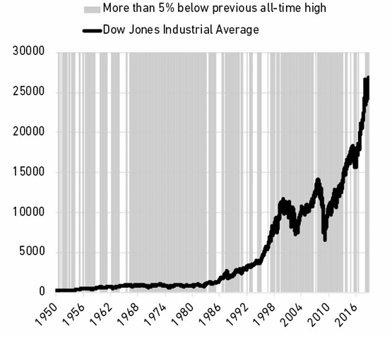

# فصل پانزدهم: هیچ‌چیز مجانی نیست

**همه چیز قیمتی دارد، اما تمام قیمت‌ها روی برچسب‌ها نوشته نمی‌شوند.**

همه چیز قیمتی دارد و کلیدِ خیلی از مسائلِ مالی این است که فقط بفهمید آن قیمت چقدر است و مایل به پرداختش باشید. مشکل اینجاست که قیمتِ خیلی از چیزها تا زمانی که شخصاً تجربه‌شان نکنید و موعدِ پرداخت قبضشان نگذشته باشد، مشخص نیست.

جنرال الکتریک (GE) در سال ۲۰۰۴ بزرگترین شرکت جهان بود و ارزشی معادل یک‌سوم تریلیون دلار داشت. در دههٔ قبل از آن، هر سال یا اول بود یا دوم؛ نمونهٔ درخشانِ سرمایه‌داری از اشرافیتِ شرکتی.

سپس همه‌چیز از هم پاشید.

بحران مالی ۲۰۰۸، بخشِ تأمین مالیِ GE —که بیش از نیمی از سود شرکت را تأمین می‌کرد— را به آشوب کشاند. این بخش در نهایت به قیمتِ آهن‌قراضه فروخته شد. شرط‌بندی‌های بعدی روی نفت و انرژی فاجعه‌بار بودند و منجر به میلیاردها دلار زیان شدند. سهام GE از ۴۰ دلار در سال ۲۰۰۷ به ۷ دلار در سال ۲۰۱۸ سقوط کرد.

سرزنش‌ها فوراً و به‌سختی متوجه جف ایملت (Jeff Immelt) شد؛ مدیرعاملی که از سال ۲۰۰۱ شرکت را اداره می‌کرد. او به خاطر رهبری‌اش، خریدهایش، قطع سود سهام، اخراج کارگران و —البته— سقوط قیمت سهام مورد انتقاد قرار گرفت. و حق هم همین بود: کسانی که در دوران خوشی با ثروت‌های افسانه‌ای پاداش می‌گیرند، وقتی آب‌ها پایین می‌رود باید بارِ مسئولیت را به دوش بکشند.

او در سال ۲۰۱۷ کناره‌گیری کرد. اما ایملت هنگام رفتن حرفِ پربصیرتی زد. در پاسخ به منتقدانی که می‌گفتند کارهای او اشتباه بوده و اینکه «چه کاری باید انجام می‌داد» کاملاً واضح بوده است، ایملت به جانشین خود گفت: **«هر شغلی آسان به نظر می‌رسد وقتی شما کسی نیستید که آن را انجام می‌دهد.»**

هر شغلی آسان به نظر می‌رسد وقتی شما مجریِ آن نیستید، چون چالش‌هایی که یک نفر در میدانِ عمل با آن‌ها روبروست، اغلب برای کسانی که در جایگاه تماشاچی نشسته‌اند نامرئی است. سروکله زدن با خواسته‌های متضادِ یک سازمانِ عریض و طویل، سرمایه‌گذارانِ کوتاه‌مدت، رگولاتورها، اتحادیه‌ها و بوروکراسیِ ریشه‌دار، نه تنها انجامش سخت است، بلکه حتی تشخیصِ شدتِ مشکلات هم دشوار است تا زمانی که خودتان مشغولِ حلِ آن‌ها شوید. جانشینِ ایملت که فقط ۱۴ ماه دوام آورد هم این را یاد گرفت.

بیشترِ چیزها در عمل سخت‌تر از تئوری هستند. گاهی به این خاطر که ما بیش از حد اعتمادبه‌نفس داریم. اما اغلب به این خاطر است که ما در تشخیصِ **قیمتِ موفقیت** مهارت نداریم؛ و همین مانع می‌شود که بتوانیم آن را بپردازیم.

شاخص S&P 500 در طول ۵۰ سالِ منتهی به ۲۰۱۸، ۱۱۹ برابر شد. تمام کاری که باید می‌کردید این بود که عقب بنشینید و اجازه دهید پولتان مرکب شود. اما خب، سرمایه‌گذاریِ موفق آسان به نظر می‌رسد وقتی شما کسی نیستید که انجامش می‌دهد.

می‌شنوید که می‌گویند: «سهام را برای بلندمدت نگه دار.» توصیهٔ خوبی است. اما می‌دانید حفظِ دیدگاه بلندمدت چقدر سخت است وقتی سهام در حال فروپاشی است؟

مثل هر چیزِ باارزشِ دیگر، سرمایه‌گذاریِ موفق نیازمندِ پرداختِ یک قیمت است. اما واحدِ پولِ این قیمت، دلار و سنت نیست. واحدِ آن **نوسان، ترس، شک، عدم قطعیت و پشیمانی** است—که نادیده گرفتنِ همهٔ آن‌ها آسان است تا زمانی که در لحظه با آن‌ها دست‌وپنج نرم کنید.

ناتوانی در تشخیص اینکه سرمایه‌گذاری قیمتی دارد، می‌تواند ما را وسوسه کند که تلاش کنیم چیزی را مفت به دست آوریم. که مثلِ دزدی از فروشگاه، به‌ندرت عاقبتِ خوشی دارد.

فرض کنید یک ماشینِ نو می‌خواهید. قیمتش ۳۰,۰۰۰ دلار است. شما سه گزینه دارید:
۱) ۳۰,۰۰۰ دلار بپردازید.
۲) یک ماشین دست‌دومِ ارزان‌تر پیدا کنید.
۳) آن را بدزدید.

در این مورد، ۹۹٪ مردم می‌دانند که باید از گزینه سوم پرهیز کنند، چون عواقبِ دزدی ماشین سنگین‌تر از منفعتِ آن است.

اما فرض کنید می‌خواهید طی ۳۰ سالِ آینده بازدهیِ سالانه ۱۱٪ داشته باشید تا بتوانید با آرامش بازنشسته شوید. آیا این پاداش رایگان است؟ البته که نه. دنیا هرگز این‌قدر مهربان نیست. یک برچسبِ قیمت وجود دارد، یک صورت‌حساب که باید پرداخت شود. در این مورد، قیمت عبارت است از ریشخندهای بی‌پایانِ بازار، که بازدهی‌های بزرگ می‌دهد و با همان سرعت آن‌ها را پس می‌گیرد.

با احتسابِ سودِ نقدی، میانگین صنعتی داوجونز از سال ۱۹۵۰ تا ۲۰۱۹ حدود ۱۱٪ در سال بازدهی داشته که عالی است. اما قیمتِ موفقیت در این دوره به‌طرز وحشتناکی بالا بود. خطوط سایه‌دار در نمودار نشان می‌دهند که چه زمانی شاخص حداقل ۵٪ پایین‌تر از اوجِ تاریخیِ قبلیِ خود بوده است.

 

این قیمتِ بازدهیِ بازار است. **هزینه (Fee).** این هزینهٔ ورودی است. و دردناک است.

مثل اکثرِ محصولات، هرچه بازدهی بزرگ‌تر باشد، قیمت بالاتر است. سهام نتفلیکس از سال ۲۰۰۲ تا ۲۰۱۸ بیش از ۳۵,۰۰۰٪ بازدهی داشت، اما در ۹۴٪ از روزهای این دوره، پایین‌تر از اوجِ تاریخیِ قبلیِ خود معامله می‌شد. مانستر بورج (نوشابه انرژی‌زا) از ۱۹۹۵ تا ۲۰۱۸ حدود ۳۱۹,۰۰۰٪ بازدهی داد—یکی از بالاترین بازدهی‌ها در تاریخ—اما در ۹۵٪ از مواقعِ آن دوره، پایین‌تر از اوجِ قبلی‌اش بود.

حالا بخش مهم ماجرا اینجاست. مثلِ همان مثالِ ماشین، شما چند گزینه دارید:
می‌توانید این قیمت را بپردازید؛ یعنی نوسان و آشوب را بپذیرید.
یا می‌توانید دارایی‌ای با عدم‌قطعیتِ کمتر و بازدهیِ کمتر پیدا کنید (معادلِ ماشین دست‌دوم).
یا می‌توانید معادلِ «سرقتِ بزرگِ اتومبیل» را امتحان کنید: تلاش کنید بازدهی را بگیرید اما از نوسانی که همراه آن می‌آید فرار کنید.

بسیاری از افراد در سرمایه‌گذاری گزینهٔ سوم را انتخاب می‌کنند. مثلِ یک سارقِ ماشین—هرچند با نیتِ خوب و مطیعِ قانون—ترفندها و استراتژی‌هایی می‌سازند تا بازدهی را بدون پرداختِ قیمت به دست آورند. آن‌ها مدام خرید و فروش می‌کنند. تلاش می‌کنند قبل از رکودِ بعدی بفروشند و قبل از رونقِ بعدی بخرند.

اکثرِ سرمایه‌گذاران با حتی اندکی تجربه می‌دانند که نوسان واقعی و رایج است. بسیاری از آن‌ها سپس قدمی را برمی‌دارند که منطقی به نظر می‌رسد: تلاش برای اجتناب از آن. اما خدایانِ پول به کسانی که بدون پرداختِ قیمت به دنبال پاداش هستند، روی خوش نشان نمی‌دهند. برخی سارقانِ ماشین قسر در می‌روند. اما بسیاری دیگر دستگیر و مجازات می‌شوند. در سرمایه‌گذاری هم همین‌طور است.

مورنینگ‌استار (Morningstar) زمانی عملکردِ صندوق‌های سرمایه‌گذاریِ تاکتیکی (Tactical Mutual Funds) را بررسی کرد؛ استراتژیِ این صندوق‌ها این است که در زمان‌های مناسب بین سهام و اوراق قرضه جابجا شوند تا بازدهی بازار را با ریسکِ افتِ کمتر شکار کنند. آن‌ها بازدهی را می‌خواهند بدون پرداختِ قیمت.

این مطالعه روی دوره اواسط ۲۰۱۰ تا اواخر ۲۰۱۱ متمرکز بود؛ زمانی که بازارهای سهام آمریکا به خاطر ترس از یک رکودِ جدید متلاطم شدند و S&P 500 بیش از ۲۰٪ ریزش کرد. این دقیقاً همان محیطی است که صندوق‌های تاکتیکی قرار است در آن کار کنند. لحظهٔ درخششِ آن‌ها بود.

طبق آمار مورنینگ‌استار، در این دوره ۱۱۲ صندوق تاکتیکی وجود داشت. تنها ۹ مورد از آن‌ها بازدهیِ تعدیل‌شده‌بر‌اساسِ‌ریسکِ بهتری نسبت به یک صندوقِ سادهٔ ترکیبی (۶۰٪ سهام / ۴۰٪ اوراق) داشتند. کمتر از یک‌چهارمِ صندوق‌های تاکتیکی، افتِ سرمایهٔ (Drawdown) کمتری نسبت به شاخصِ «بخر و رها کن» داشتند. مورنینگ‌استار نوشت: «با چند استثنا، [صندوق‌های تاکتیکی] سودِ کمتری بردند، نوسانِ بیشتری داشتند، یا دقیقاً به اندازهٔ صندوق‌های غیرفعال در معرضِ ریسکِ نزول بودند.»

سرمایه‌گذارانِ خُرد هم وقتی خودشان سرمایه‌گذاری می‌کنند در همین دام می‌افتند. طبق گزارش مورنینگ‌استار، سرمایه‌گذارِ متوسط در صندوق‌های سهامی، سالانه نیم درصد کمتر از خودِ صندوق‌هایی که در آن سرمایه‌گذاری کرده بود سود برد—نتیجهٔ خرید و فروش کردن در زمانی که باید فقط می‌خریدند و نگه می‌داشتند.

طنز ماجرا اینجاست که سرمایه‌گذاران با تلاش برای اجتناب از پرداخت قیمت، در نهایت دو برابر پرداخت می‌کنند.

برگردیم به جنرال الکتریک. یکی از ایراداتِ متعددِ آن ریشه در دورانِ مدیرعاملِ اسبق، جک ولش (Jack Welch) دارد. ولش معروف بود به اینکه تضمین می‌کرد سودِ هر سهم در گزارش‌های فصلی، برآوردهای وال‌استریت را شکست دهد. او استادِ اعظم بود. اگر تحلیلگرانِ وال‌استریت انتظارِ ۲۵ سنت سود برای هر سهم داشتند، جک ۲۶ سنت تحویل می‌داد؛ مهم نبود وضعیتِ کسب‌وکار یا اقتصاد چطور باشد.

او این کار را با «ماساژ دادنِ اعداد» انجام می‌داد —که توصیفِ مؤدبانه‌ای است— و اغلب سودهای فصل‌های آینده را به فصلِ جاری می‌کشید تا اعدادِ مطیع را وادار کند به اربابشان سلام نظامی دهند. فوربس یکی از ده‌ها نمونه را گزارش کرد: «[جنرال الکتریک] برای دو سال متوالی لکوموتیوهایی را به جای مصرف‌کنندگانِ نهایی به شرکای مالیِ بی‌نام و نشانی ‘فروخت’؛ در معاملاتی که بیشترِ ریسکِ مالکیت را برای GE باقی می‌گذاشت.»

ولش هرگز این بازی را انکار نکرد. او در کتابش نوشت:
«واکنشِ رهبرانِ کسب‌وکارِ ما به بحران‌ها، نمونه‌ای از فرهنگِ GE بود. حتی با اینکه دفاترِ حسابداریِ فصل بسته شده بود، بسیاری فوراً پیشنهاد می‌دادند که آستین بالا بزنند تا شکافِ [درآمدی] را پُر کنند. برخی می‌گفتند می‌توانند ۱۰ میلیون، ۲۰ میلیون و حتی ۳۰ میلیون دلارِ اضافه از کسب‌وکارشان پیدا کنند تا غافلگیری را جبران کنند.»

نتیجه این بود که در دورانِ رهبری ولش، سهامداران مجبور نبودند قیمت را بپردازند. آن‌ها ثبات و پیش‌بینی‌پذیری دریافت کردند—سهامی که سال به سال بدونِ غافلگیری‌های عدم‌قطعیت، اوج می‌گرفت.

سپس قبضِ صورت‌حساب آمد، همان‌طور که همیشه می‌آید. سهامدارانِ GE یک دهه زیانِ عظیم را متحمل شده‌اند که قبلاً توسط مانورهای حسابداری پنهان شده بود. سودهای چند پِنیِ دورانِ ولش، امروز تبدیل به زیان‌های چند دلاری شد.

عجیب‌ترین مثالِ این موضوع مربوط به غول‌های وام مسکنِ شکست‌خورده، فردی مک (Freddie Mac) و فانی می (Fannie Mae) است که در اوایل دهه ۲۰۰۰ مچشان گرفته شد که میلیاردها دلار از درآمدهای جاری را کمتر گزارش می‌کردند تا آن سودها را در دوره‌های آینده پخش کنند و به سرمایه‌گذاران توهمِ همواری و پیش‌بینی‌پذیری بدهند.
توهمِ اینکه لازم نیست قیمت را بپردازید.

سؤال این است: چرا این‌همه آدم که حاضرند قیمتِ ماشین، خانه، غذا و تعطیلات را بپردازند، این‌قدر سخت تلاش می‌کنند تا از پرداختِ قیمتِ بازدهیِ سرمایه‌گذاری خوب فرار کنند؟

جواب ساده است: **قیمتِ موفقیت در سرمایه‌گذاری فوراً قابلِ مشاهده نیست.**

این یک برچسبِ قیمت نیست که بتوانید ببینید، بنابراین وقتی صورت‌حساب می‌آید، حسِ پرداختِ یک **«هزینه» (Fee)** برای گرفتنِ یک چیزِ خوب را ندارد. بلکه حسِ یک **«جریمه» (Fine)** برای انجامِ کارِ اشتباه را دارد. و در حالی که مردم معمولاً با پرداختِ هزینه مشکلی ندارند، جریمه‌ها چیزهایی هستند که باید از آن‌ها اجتناب کرد. شما باید تصمیماتی بگیرید که پیشگیری کنید و جریمه نشوید. جریمه‌های رانندگی و جریمه‌های مالیاتی یعنی کار اشتباهی کردید و لایق تنبیه‌اید.

واکنشِ طبیعیِ هر کسی که می‌بیند ثروتش کاهش یافته و آن کاهش را به عنوانِ «جریمه» می‌بیند، این است که از جریمه‌های آینده اجتناب کند.

شاید پیش‌پاافتاده به نظر برسد، اما فکر کردن به نوساناتِ بازار به عنوانِ یک **«هزینه» (Fee)** به جای یک **«جریمه» (Fine)**، بخشِ مهمی از توسعهٔ آن نوع طرز فکری است که به شما اجازه می‌دهد آن‌قدر در بازار دوام بیاورید تا سودهای سرمایه‌گذاری به نفع شما کار کنند.

کمتر سرمایه‌گذاری این روحیه را دارد که بگوید: «من واقعاً مشکلی ندارم اگر ۲۰٪ از پولم را از دست بدهم.» این برای سرمایه‌گذارانِ جدیدی که هرگز افت ۲۰ درصدی را تجربه نکرده‌اند، دوچندان صادق است.

اما اگر نوسان را به عنوان یک «هزینه» ببینید، همه‌چیز متفاوت به نظر می‌رسد.

بلیط دیزنی‌لند ۱۰۰ دلار است. اما شما یک روزِ معرکه با بچه‌هایتان دارید که هرگز فراموش نخواهید کرد. سال گذشته بیش از ۱۸ میلیون نفر فکر کردند که این «هزینه» ارزشِ پرداخت را دارد. کمتر کسی حس کرد که آن ۱۰۰ دلار یک تنبیه یا جریمه است. وقتی روشن باشد که دارید چه چیزی را پرداخت می‌کنید، معاملهٔ ارزشمندِ «هزینه در برابرِ خدمات» واضح است.

در سرمایه‌گذاری هم همین‌طور است؛ جایی که نوسان تقریباً همیشه یک هزینه است، نه جریمه.

بازدهی‌های بازار هرگز مجانی نیستند و نخواهند بود. آن‌ها از شما می‌خواهند قیمتی بپردازید، مثل هر محصولِ دیگری. شما مجبور نیستید این هزینه را بپردازید، درست همان‌طور که مجبور نیستید به دیزنی‌لند بروید. می‌توانید به شهربازیِ محلی بروید که بلیطش شاید ۱۰ دلار باشد، یا مجانی در خانه بمانید. شاید باز هم خوش بگذرد. اما معمولاً همان‌قدر که پول می‌دهید آش می‌خورید. در بازارها هم همین است. هزینهٔ نوسان/عدم‌قطعیت —یعنی قیمتِ بازدهی‌ها— هزینهٔ ورودی برای گرفتنِ بازدهی‌هایی است که از پارک‌های کم‌هزینه‌ای مثل پولِ نقد و اوراق قرضه بیشتر است.

تِرفند کار این است که خودتان را متقاعد کنید که هزینهٔ بازار ارزشش را دارد. این تنها راهِ برخوردِ درست با نوسان و عدم‌قطعیت است—نه فقط تحمل کردنِ آن، بلکه درکِ اینکه این یک هزینهٔ ورودی است که ارزشِ پرداخت را دارد.

تضمینی نیست که حتماً ارزشش را داشته باشد. گاهی در دیزنی‌لند هم باران می‌بارد. اما اگر هزینهٔ ورودی را به چشمِ جریمه ببینید، هرگز از جادو لذت نخواهید برد.

قیمت را پیدا کنید، سپس آن را بپردازید.
