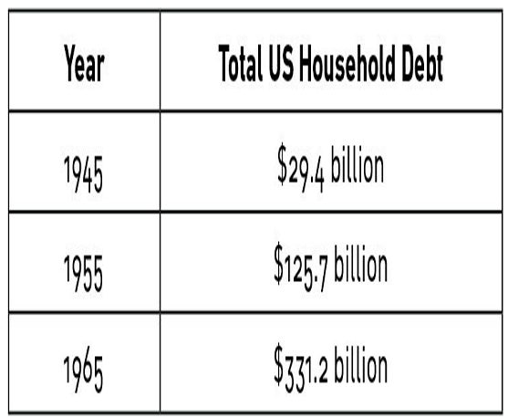
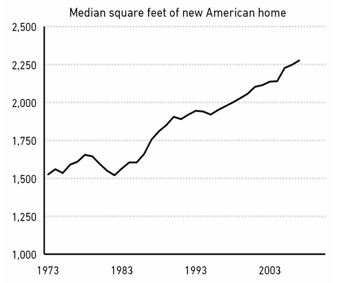

# پس‌گفتار

### **تاریخچهٔ مختصری از اینکه چرا مصرف‌کنندهٔ آمریکایی این‌گونه فکر می‌کند**

برای درکِ روانشناسیِ مصرف‌کنندهٔ مدرن و فهمیدنِ اینکه ممکن است به کجا برود، باید بدانید چطور به اینجا رسیده است. چطور همهٔ ما به اینجا رسیدیم.

اگر در سال ۱۹۴۵ به خواب می‌رفتید و در سال ۲۰۲۰ بیدار می‌شدید، دنیای اطرافتان را نمی‌شناختید. میزان رشد اقتصادی‌ای که در آن دوره رخ داد، عملاً بی‌سابقه است.

اگر سطح ثروت در نیویورک و سان‌فرانسیسکو را می‌دیدید، شوکه می‌شدید. اگر آن را با فقرِ دیترویت مقایسه می‌کردید، شوکه می‌شدید. اگر قیمتِ خانه‌ها، شهریهٔ دانشگاه و مراقبت‌های بهداشتی را می‌دیدید، شوکه می‌شدید. اگر می‌دیدید آمریکایی‌های متوسط چطور درباره پس‌انداز و خرج کردن فکر می‌کنند، شوکه می‌شدید.

و اگر سعی می‌کردید روایتی معقول از اینکه «همهٔ این‌ها چطور اتفاق افتاد» بسازید، حدس من این است که کاملاً اشتباه می‌کردید. چون این روند شهودی (Intuitive) نیست و قابل پیش‌بینی هم نبود.

آنچه در آمریکا از پایان جنگ جهانی دوم رخ داد، داستانِ مصرف‌کنندهٔ آمریکایی است. داستانی است که کمک می‌کند توضیح دهیم چرا مردم امروز این‌گونه درباره پول فکر می‌کنند.

داستان کوتاه این است:
اوضاع خیلی نامشخص بود، بعد خیلی خوب شد، بعد نسبتاً بد شد، بعد واقعاً خوب شد، بعد واقعاً بد شد، و حالا اینجاییم.

و من فکر می‌کنم روایتی وجود دارد که همهٔ آن رویدادها را به هم پیوند می‌زند. نه یک گزارشِ دقیق. بلکه داستانی از اینکه چطور تکه‌ها کنار هم جور می‌شوند.

از آنجا که این تلاشی برای پیوند دادنِ رویدادهای بزرگ است، جزئیاتِ زیادی از آنچه در این دوره رخ داده را جا می‌اندازد. من احتمالاً با هر کسی که به مواردِ ازقلم‌افتاده اشاره کند موافقم. هدف اینجا توصیفِ تک‌تکِ بازی‌ها نیست؛ بلکه نگاه به این است که چطور یک بازی بر بازیِ بعدی تأثیر گذاشت.

این‌گونه بود که مصرف‌کنندهٔ مدرن به اینجا رسید.

---

**۱. اوت، ۱۹۴۵. جنگ جهانی دوم پایان می‌یابد.**

تسلیم شدنِ ژاپن به گفتهٔ *نیویورک تایمز* «شادترین روز در تاریخ آمریکا» بود.

اما این جمله معروف هست که: «تاریخ فقط یک‌چیزِ لعنتی بعد از چیزِ لعنتیِ دیگر است.» شادیِ پایان جنگ به‌سرعت با این سؤال روبرو شد: «حالا چه می‌شود؟»

شانزده میلیون آمریکایی—۱۱٪ از جمعیت—در جنگ خدمت کرده بودند. حدود هشت میلیون نفر در پایانِ جنگ در خارج از کشور بودند. میانگین سنی آن‌ها ۲۳ سال بود. ظرف ۱۸ ماه، همه به جز ۱.۵ میلیون نفر از آن‌ها به خانه برمی‌گشتند و یونیفرم را در می‌آوردند.

و بعدش چه؟ قرار بود چه کار کنند؟ کجا کار کنند؟ کجا زندگی کنند؟

این‌ها مهم‌ترین سؤالاتِ روز بودند، به دو دلیل.
یک، هیچ‌کس جواب‌ها را نمی‌دانست.
دو، اگر نمی‌شد به‌سرعت جوابی پیدا کرد، محتمل‌ترین سناریو—در چشم بسیاری از اقتصاددانان—این بود که اقتصاد دوباره به اعماقِ «رکود بزرگ» (Great Depression) سقوط کند.

سه نیرو در طول جنگ شکل گرفته بود:
۱. ساخت‌وساز مسکن متوقف شده بود، چون عملاً تمام ظرفیتِ تولید به ساختِ ملزومات جنگی تغییر یافته بود. در سال ۱۹۴۳ کمتر از ۱۲,۰۰۰ خانه در ماه ساخته می‌شد؛ معادل کمتر از یک خانهٔ جدید برای هر شهرِ آمریکا. سربازانِ بازگشته با کمبودِ شدیدِ مسکن روبرو بودند.
۲. شغل‌های خاصی که در طول جنگ ایجاد شده بود—ساخت کشتی، تانک و هواپیما—خیلی ناگهانی بعد از جنگ غیرضروری شدند؛ توقفی با سرعت و ابعادی که به‌ندرت در کسب‌وکار خصوصی دیده می‌شود. معلوم نبود سربازان کجا می‌توانند کار کنند.
۳. نرخ ازدواج در طول جنگ و بلافاصله بعد از آن جهش کرد. سربازان نمی‌خواستند به زیرزمینِ خانهٔ مادرشان برگردند. آن‌ها می‌خواستند فوراً خانواده تشکیل دهند، در خانهٔ خودشان، با شغلی خوب.

این موضوع سیاست‌گذاران را نگران می‌کرد، به‌ویژه که رکود بزرگ هنوز خاطره‌ای تازه بود و تنها پنج سال پیش تمام شده بود.

در سال ۱۹۴۶ شورای مشاوران اقتصادی گزارشی به رئیس‌جمهور ترومن داد و نسبت به «یک افسردگیِ اقتصادیِ تمام‌عیار در یک تا چهار سالِ آینده» هشدار داد.

آن‌ها در یادداشت جداگانه‌ای در سال ۱۹۴۷، در خلاصهٔ جلسه‌ای با ترومن نوشتند:
> «ما ممکن است در نوعی دورهٔ رکود باشیم که باید خیلی مطمئن شویم نیروهای رکودی در خطرِ خارج شدن از کنترل نیستند... چشم‌اندازِ قابل‌توجهی وجود دارد که نباید نادیده گرفته شود، که یک نزولِ بیشتر ممکن است خطرِ یک مارپیچِ نزولی به سمتِ شرایطِ افسردگی (Depression) را افزایش دهد.»

این ترس با این واقعیت تشدید می‌شد که نمی‌شد فوراً برای رشد روی صادرات حساب کرد، چرا که دو تا از بزرگ‌ترین اقتصادها—اروپا و ژاپن—در ویرانه‌ها نشسته بودند و با بحران‌های انسانی دست‌وپنج نرم می‌کردند. و آمریکا خودش زیرِ کوهی از بدهی دفن شده بود که بیشتر از هر زمانِ دیگری بود و محرک‌های مستقیمِ دولتی را محدود می‌کرد.

بنابراین ما کاری در موردش کردیم.

**۲. نرخ بهره پایین و تولدِ عامدانهٔ مصرف‌کنندهٔ آمریکایی.**

اولین کاری که برای شناور نگه داشتنِ اقتصاد بعد از جنگ کردیم، پایین نگه داشتنِ نرخ بهره بود.

این تصمیم آسانی نبود، چون وقتی سربازان به خانه برگشتند و با کمبودِ همه‌چیز از لباس تا ماشین مواجه شدند، تورم موقتاً دو رقمی شد.

فدرال رزرو قبل از ۱۹۵۱ از نظر سیاسی مستقل نبود. رئیس‌جمهور و فد می‌توانستند سیاست‌ها را هماهنگ کنند. در سال ۱۹۴۲ فد اعلام کرد نرخ‌های کوتاه‌مدت را روی ۰.۳۸٪ نگه می‌دارد تا به تأمین مالی جنگ کمک کند. نرخ‌ها برای هفت سالِ بعدی حتی یک نقطهٔ پایه (Basis point) هم تکان نخوردند. بازدهیِ خزانهٔ سه‌ماهه تا اواسط دهه ۱۹۵۰ زیر ۲٪ ماند.

دلیلِ صریح برای پایین نگه داشتنِ نرخ‌ها، پایین نگه داشتنِ هزینهٔ تأمین مالیِ معادلِ ۶ تریلیون دلاری بود که خرجِ جنگ کرده بودیم.

اما نرخ‌های پایین برای تمامِ سربازان (GI) بازگشته هم کارِ دیگری کرد. قرض گرفتن برای خریدِ خانه، ماشین، ابزارها و اسباب‌بازی‌ها را واقعاً ارزان کرد.

که از دیدگاهِ یک سیاست‌گذارِ پارانوید (وحشت‌زده از رکود)، عالی بود.

مصرف‌گرایی (Consumption) در سال‌های بعد از جنگ جهانی دوم تبدیل به یک استراتژیِ اقتصادیِ صریح شد. دورانی از تشویق به صرفه‌جویی و پس‌انداز برای تأمین مالی جنگ، به‌سرعت به دورانی از ترویجِ فعالانهٔ خرج کردن تبدیل شد.

شلدون گارون، تاریخدان پرینستون، می‌نویسد:
> «بعد از ۱۹۴۵، آمریکا دوباره از الگوهای ترویجِ پس‌انداز در اروپا و شرق آسیا فاصله گرفت... سیاستمداران، بازرگانان و رهبران کارگری همگی آمریکایی‌ها را تشویق به خرج کردن کردند تا رشد اقتصادی را تقویت کنند.»

دو چیز سوختِ این فشار را تأمین کرد.

یکی **لایحهٔ جی‌آی (GI Bill)** بود که فرصت‌های بی‌سابقهٔ وام مسکن ارائه می‌داد. شانزده میلیون کهنه‌سرباز می‌توانستند خانه بخرند، اغلب بدونِ پیش‌پرداخت، بدون بهره در سال اول، و با نرخ‌های ثابتی چنان پایین که اقساطِ ماهانهٔ وام می‌توانست کمتر از اجاره‌خانه باشد.

دومی **انفجارِ اعتبارِ مصرف‌کننده (Consumer Credit)** بود که با شل کردنِ مقرراتِ دورانِ رکود امکان‌پذیر شد. اولین کارت اعتباری در سال ۱۹۵۰ معرفی شد. اعتبارِ فروشگاهی، اعتبارِ قسطی، وام‌های شخصی، وام‌های روزِ پرداخت—همه‌چیز اوج گرفت.

و بهرهٔ تمامِ بدهی‌ها، شامل کارت‌های اعتباری، در آن زمان **قابل کسر از مالیات** (Tax deductible) بود.

طعمش خوشمزه بود. بنابراین ما مقدار زیادی از آن خوردیم.

یک داستان ساده در یک جدول ساده:

 

بدهی خانوارها در دهه ۱۹۵۰، ۱.۵ برابر سریع‌تر از دورهٔ ولخرجیِ بدهیِ دهه ۲۰۰۰ رشد کرد.

**۳. تقاضای سرکوب‌شده (Pent-up demand) برای کالاها که با رونقِ اعتباری و رونقِ پنهانِ بهره‌وریِ دهه ۱۹۳۰ تغذیه می‌شد، منجر به یک رونقِ اقتصادی شد.**

دهه ۱۹۳۰ سخت‌ترین دههٔ اقتصادی در تاریخ آمریکا بود. اما یک نیمهٔ پر داشت که دو دهه طول کشید تا متوجهش شویم: به حکمِ ضرورت، رکود بزرگ باعثِ تقویتِ فوق‌العادهٔ تدبیر، بهره‌وری و نوآوری شده بود.

ما در دهه ۳۰ توجه زیادی به رونقِ بهره‌وری نکردیم، چون همه روی این تمرکز داشتند که اقتصاد چقدر خراب است. در دهه ۴۰ هم به آن توجه نکردیم، چون همه روی جنگ متمرکز بودند.

سپس دهه ۱۹۵۰ از راه رسید و ناگهان متوجه شدیم: «وای، ما اختراعاتِ جدیدِ شگفت‌انگیزی داریم. و در ساختنِ آن‌ها هم واقعاً خوب هستیم.»

لوازم خانگی، ماشین‌ها، تلفن‌ها، تهویه مطبوع، برق.

خرید بسیاری از کالاهای خانگی در طول جنگ تقریباً غیرممکن بود، چون کارخانه‌ها برای ساخت اسلحه و کشتی تغییر کاربری داده بودند. این موضوع تقاضای سرکوب‌شده‌ای از سمت سربازان (GI) برای کالاها بعد از پایان جنگ ایجاد کرد.

آن‌ها که ازدواج کرده بودند، مشتاقِ ادامهٔ زندگی بودند و با اعتبارِ مصرفیِ ارزانِ جدید دلگرم شده بودند، وارد یک دورهٔ خریدِ جنون‌آمیز شدند که کشور هرگز ندیده بود.

فردریک لوئیس آلن در کتابش *تغییرِ بزرگ* می‌نویسد:
> «در طول این سال‌های پس از جنگ، کشاورز یک تراکتور جدید، یک ماشین ذرت‌چین و یک ماشین شیردوشی برقی خرید؛ در واقع او و همسایگانش، با هم، مجموعه‌ای از ماشین‌آلات کشاورزیِ قدرتمند برای استفاده مشترکشان جمع کردند. همسرِ کشاورز صاحب یخچال برقیِ سفید و درخشانی شد که همیشه آرزویش را داشت و هرگز در طول رکود بزرگ نتوانسته بود بخرد، و یک ماشین لباسشوییِ به‌روز و یک فریزرِ صندوقی. خانوادهٔ حومه‌نشین ماشین ظرفشویی نصب کرد و روی یک ماشین چمن‌زنیِ موتوری سرمایه‌گذاری کرد. خانوادهٔ شهری مشتریِ رختشویخانه‌ها شد و یک دستگاه تلویزیون برای اتاق نشیمن تهیه کرد. دفترِ شوهر تهویه مطبوع داشت. و همین‌طور بی‌پایان ادامه داشت.»

دشوار است که در توصیف بزرگیِ این موج زیاده‌روی کنیم.

تولید تجاریِ خودرو و کامیون عملاً از ۱۹۴۲ تا ۱۹۴۵ متوقف شد. سپس ۲۱ میلیون خودرو از ۱۹۴۵ تا ۱۹۴۹ فروخته شد. ۲۰ میلیونِ دیگر تا ۱۹۵۵ فروخته شد.

کمتر از دو میلیون خانه از ۱۹۴۰ تا ۱۹۴۵ ساخته شد. سپس هفت میلیون خانه از ۱۹۴۵ تا ۱۹۵۰ ساخته شد. هشت میلیونِ دیگر تا ۱۹۵۵ ساخته شد.

تقاضای سرکوب‌شده برای **کالاها**، و تواناییِ تازه‌یافتهٔ ما برای **ساختنِ کالاها**، شغل‌هایی ایجاد کرد که سربازانِ بازگشته را دوباره سرِ کار فرستاد. و شغل‌های خوبی هم بودند.

این را با اعتبارِ مصرفی (وام) مخلوط کنید، و ظرفیتِ آمریکا برای خرج کردن منفجر شد.

فدرال رزرو در سال ۱۹۵۱ به رئیس‌جمهور ترومن نوشت: «تا سال ۱۹۵۰، کلِ مخارجِ مصرف‌کنندگان، به همراهِ ساخت‌وسازِ مسکونی، به حدود ۲۰۳ میلیارد دلار رسید، یا در همسایگیِ ۴۰ درصد بالاتر از سطحِ سال ۱۹۴۴.»

پاسخ به این سؤال که «همهٔ این سربازان بعد از جنگ چه کار خواهند کرد؟» حالا واضح بود. آن‌ها قرار بود کالا بخرند، با پولی که از شغل‌هایشان در ساختِ کالاهای جدید در می‌آوردند، که با پولِ قرضیِ ارزان برای خریدِ کالاهای باز هم بیشتر کمک می‌شد.

**۴. دستاوردها برابرتر از هر زمانِ دیگری تقسیم می‌شد.**

ویژگیِ تعیین‌کنندهٔ اقتصاد در دهه ۱۹۵۰ این است که کشور با ثروتمند کردنِ فقرا، ثروتمند شد.

میانگینِ دستمزدها از ۱۹۴۰ تا ۱۹۴۸ دو برابر شد، سپس تا ۱۹۶۳ دوباره دو برابر شد.

و آن دستاوردها روی کسانی متمرکز بود که برای دهه‌ها عقب مانده بودند. شکافِ بین ثروتمند و فقیر به‌میزانِ خارق‌العاده‌ای کاهش یافت.

لوئیس آلن در سال ۱۹۵۵ نوشت:
> «فاصلهٔ عظیمِ مرفهین در مسابقهٔ اقتصادی به‌شکل قابل‌توجهی کاهش یافته است. این کارگرانِ صنعتی هستند که به عنوان یک گروه بهترین عملکرد را داشته‌اند—آدم‌هایی مثل خانوادهٔ یک کارگر فولاد که قبلاً با ۲۵۰۰ دلار زندگی می‌کردند و حالا ۴۵۰۰ دلار می‌گیرند، یا خانوادهٔ یک اپراتورِ ماشین‌آلاتِ بسیار ماهر که قبلاً ۳۰۰۰ دلار داشت و حالا می‌تواند سالانه ۵۵۰۰ دلار یا بیشتر خرج کند.
> اما در مورد یک درصدِ بالا، یعنی واقعاً مرفهین و ثروتمندان، که ما می‌توانیم خیلی حدودی آن‌ها را در گروهِ ۱۶۰۰۰ دلار و بالاتر طبقه‌بندی کنیم، سهمِ آن‌ها از کلِ درآمدِ ملی، بعد از مالیات، تا سال ۱۹۴۵ از ۱۳ درصد به ۷ درصد کاهش یافته بود.»

این یک روندِ کوتاه‌مدت نبود. درآمدِ واقعی برای ۲۰ درصدِ پایینِ حقوق‌بگیران از سال ۱۹۵۰ تا ۱۹۸۰ تقریباً به همان میزانی رشد کرد که برای ۵ درصدِ بالا رشد کرده بود.

برابری فراتر از دستمزدها رفت. زنان به تعدادِ رکوردشکنی در خارج از خانه شغل داشتند. نرخ مشارکتِ آن‌ها در نیروی کار از ۳۱ درصد بعد از جنگ به ۳۷ درصد تا ۱۹۵۵، و به ۴۰ درصد تا ۱۹۶۵ رسید.

اقلیت‌ها هم سود بردند. پس از تحلیفِ ۱۹۴۵، النور روزولت درباره یک گزارشگرِ آفریقایی-آمریکایی نوشت که به او گفته بود:
> «آیا می‌دانید دوازده سال چه کرده است؟ اگر در پذیرایی سال ۱۹۳۳ تعدادی از رنگین‌پوستان در صف رفته بودند و با دیگران قاطی شده بودند، همان‌طور که امروز کردند، هر روزنامه‌ای در کشور آن را گزارش می‌کرد. ما حتی فکر نمی‌کنیم که این خبر است و هیچ‌کداممان به آن اشاره نخواهیم کرد.»

حقوق زنان و اقلیت‌ها هنوز کسری از چیزی بود که امروز هست. اما پیشرفت به سمتِ برابری در اواخر دهه ۴۰ و ۵۰ خارق‌العاده بود.

هم‌سطح شدنِ طبقات به معنیِ هم‌سطح شدنِ سبک‌های زندگی بود. مردمِ عادی شِوِرلت می‌راندند. مردمِ ثروتمند کادیلاک می‌راندند. رادیو و تلویزیون سرگرمی و فرهنگی را که مردم فارغ از طبقه لذت می‌بردند، برابر کرد. کاتالوگ‌های سفارشِ پستی لباس‌هایی را که مردم می‌پوشیدند و کالاهایی را که می‌خریدند فارغ از جایی که زندگی می‌کردند، برابر کرد.

*هارپرز مگزین* (Harper’s Magazine) در سال ۱۹۵۷ نوشت:
> «مردِ ثروتمند همان نوع سیگاری را می‌کشد که مرد فقیر، با همان نوع تیغ اصلاح می‌کند، از همان نوع تلفن، جاروبرقی، رادیو و تلویزیون استفاده می‌کند، همان نوع تجهیزاتِ روشنایی و گرمایشی در خانه‌اش دارد، و الی آخر تا بی‌نهایت. تفاوت‌های بینِ اتومبیل او و اتومبیلِ مرد فقیر جزئی است. اساساً آن‌ها موتورهای مشابه و تجهیزات مشابه دارند. در اوایل قرن یک سلسله‌مراتبِ اتومبیل وجود داشت.»

پل گراهام در سال ۲۰۱۶ درباره اینکه چیزی به سادگیِ وجودِ تنها سه شبکه تلویزیونی چه کاری برای برابر کردنِ فرهنگ کرد، نوشت:
> «حالا تصورش سخت است، اما هر شب ده‌ها میلیون خانواده جلوی دستگاه تلویزیونشان می‌نشستند و همان برنامه‌ای را، در همان زمانی تماشا می‌کردند، که همسایگانِ دیواربه‌دیوارشان می‌دیدند. چیزی که الان با "سوپر بول" (Super Bowl) اتفاق می‌افتد، قبلاً هر شب اتفاق می‌افتاد. ما عملاً هماهنگ (Sync) بودیم.»

این مهم بود. مردم رفاهِ خودشان را در مقایسه با همتایانشان می‌سنجند. و برای بیشترِ دورهٔ ۱۹۴۵ تا ۱۹۸۰، مردم تعداد زیادی آدم داشتند که شبیه همتایانشان به نظر می‌رسیدند تا خودشان را با آن‌ها مقایسه کنند. بسیاری از مردم—اکثر مردم—زندگی‌هایی داشتند که یا برابر بود یا حداقل برای اطرافیانشان قابل‌درک بود.

این ایده که زندگیِ مردم به اندازهٔ درآمدهایشان برابر شد، نکتهٔ مهمی از این داستان است که به آن باز خواهیم گشت.

**۵. بدهی به‌شدت افزایش یافت. اما درآمدها هم همین‌طور، بنابراین تأثیرش معضل بزرگی نبود.**

بدهی خانوارها از سال ۱۹۴۷ تا ۱۹۵۷ به دلیل ترکیبی از فرهنگ جدیدِ مصرف‌گرایی، محصولات جدیدِ بدهی (وام)، و نرخ بهره‌هایی که با برنامه‌های دولتی یارانه می‌گرفتند و توسط فدرال رزرو پایین نگه داشته می‌شدند، پنج برابر شد.

اما رشد درآمد در این دوره چنان قوی بود که تأثیر آن بر خانوارها شدید نبود.

و بدهی خانوارها در ابتدای کار، یعنی بعد از جنگ، خیلی پایین بود. رکود بزرگ بخش زیادی از آن را پاک کرده بود و مخارج خانوار در طول جنگ چنان محدود شده بود که انباشت بدهی محدود بود.

بنابراین رشد نسبتِ بدهی-به-درآمد خانوار از ۱۹۴۷ تا ۱۹۵۷ قابل مدیریت بود. (نسبت بدهی-به-درآمد خانوار امروز کمی بیش از ۱۰۰ درصد است. حتی بعد از افزایش در دهه‌های ۱۹۵۰، ۶۰ و ۷۰، زیر ۶۰ درصد باقی ماند.)

محرکِ بخش بزرگی از این جهشِ بدهی، موجِ مالکیت خانه بود. نرخ مالکیت خانه در سال ۱۹۰۰ برابر ۴۷ درصد بود. برای چهار دههٔ بعدی تقریباً همان‌جا ماند. سپس اوج گرفت و تا ۱۹۴۵ به ۵۳ درصد و تا ۱۹۶۰ به ۶۲ درصد رسید. بخش قابل‌توجهی از جمعیت حالا از بدهی‌ای استفاده می‌کردند که نسل‌های قبل به آن دسترسی نداشتند—یا نمی‌توانستند داشته باشند.

و آن‌ها عمدتاً با این موضوع مشکلی نداشتند.

دیوید هالبرستام در کتابش *دهه پنجاه* می‌نویسد:
> «آن‌ها چنان اعتمادبه‌نفسی به خودشان و آینده‌شان داشتند که [کسانی که] در دوران‌های سخت‌تر بزرگ شده بودند را شگفت‌زده می‌کرد. آن‌ها مثل والدینشان از بدهی نمی‌ترسیدند... آن‌ها با والدینشان متفاوت بودند نه فقط در اینکه چقدر درآمد داشتند و مالک چه بودند، بلکه در باورشان به اینکه آینده از همین حالا رسیده است. به عنوان اولین مالکان خانه در خانواده‌هایشان، وقتی برای مبلمان یا لوازم خانگی خرید می‌کردند، هیجان و غرور جدیدی با خود به فروشگاه می‌آوردند—در زمان‌های دیگر زوج‌های جوان ممکن بود چنین احساساتی را هنگام خرید لباس برای اولین بچه‌شان بروز دهند. انگار خودِ دستاوردِ مالکیتِ یک خانه، نشانگر چنان پیشرفتِ عظیمی بود که هیچ‌چیز برای خریدنِ برای آن زیادی خوب نبود.»

حالا زمان خوبی است که چند چیز را به هم وصل کنیم، چون به‌طور فزاینده‌ای مهم می‌شوند:

۱. آمریکا در حال رونق است.
۲. با هم در حال رونق است، مثل هرگزِ قبل.
۳. با بدهی در حال رونق است؛ بدهی‌ای که در آن زمان چیز مهمی نیست چون هنوز نسبت به درآمد پایین است و یک پذیرشِ فرهنگی وجود دارد که بدهی چیز ترسناکی نیست.

**۶. اوضاع شروع به ترک برداشتن می‌کند.**

سال ۱۹۷۳ اولین سالی بود که مشخص شد اقتصاد دارد در مسیری جدید قدم می‌گذارد.

رکودی که آن سال شروع شد بیکاری را به بالاترین حدِ خود از دهه ۱۹۳۰ رساند. تورم جهش کرد. اما برخلافِ جهش‌های پس از جنگ، بالا ماند. نرخ بهره کوتاه‌مدت در ۱۹۷۴ به ۸ درصد رسید، در حالی که یک دهه قبل ۲.۵ درصد بود.

و باید همهٔ این‌ها را در زمینهٔ ترسِ زیادی که بین ویتنام، شورش‌ها و ترورهای مارتین لوتر کینگ، جان و بابی کندی وجود داشت بگذارید.

اوضاع تیره و تار شد.

آمریکا در دو دههٔ پس از جنگ بر اقتصادِ جهانی مسلط بود. ظرفیت تولیدیِ بسیاری از بزرگ‌ترین کشورها بمباران و تبدیل به آوار شده بود. اما با ظهور دهه ۱۹۷۰، این تغییر کرد. ژاپن در حال رونق بود. اقتصاد چین داشت باز می‌شد. خاورمیانه داشت با عضلاتِ نفتی‌اش قدرت‌نمایی می‌کرد.

ترکیبی از مزیت‌های اقتصادیِ شانسی و فرهنگی که «بهترین نسل» (Greatest Generation) در آن مشترک بودند—آب‌دیده با رکود و لنگر انداخته در همکاریِ سیستماتیکِ جنگ—زمانی که «بیبی بومرها» (Baby Boomers) شروع به بلوغ کردند، تغییر کرد. نسلی جدید که دیدگاهِ متفاوتی نسبت به آنچه «عادی» است داشت، همزمان با پایانِ بسیاری از بادهای موافقِ اقتصادیِ دو دههٔ قبل از راه رسید.

همه چیز در امور مالی، داده‌هایی در بسترِ **انتظارات** است.

یکی از بزرگ‌ترین تغییرات قرن گذشته زمانی رخ داد که بادهای اقتصادی شروع به وزیدن در جهتی متفاوت و نابرابر کردند، اما انتظارات مردم هنوز در فرهنگِ برابریِ پس از جنگ ریشه داشت.

نه لزوماً برابریِ درآمد، هرچند آن هم بود. بلکه برابری در انتظاراتِ سبک زندگی و مصرف؛ این ایده که کسی که درآمدِ صدک پنجاهم را دارد، نباید زندگی‌ای به‌شکلِ دراماتیک متفاوت از کسی که در صدک هشتادم یا نودم است داشته باشد. و اینکه کسی که در صدک نود و نهم است زندگیِ بهتری دارد، اما هنوز زندگی‌ای که کسی که در صدک پنجاهم است می‌تواند درکش کند.

آمریکا در بیشترِ دورهٔ ۱۹۴۵ تا ۱۹۸۰ این‌طور کار می‌کرد. مهم نیست فکر می‌کنید این از نظر اخلاقی درست است یا غلط. فقط مهم است که اتفاق افتاد.

انتظارات همیشه کُندتر از واقعیت‌ها حرکت می‌کنند. و واقعیت‌های اقتصادیِ سال‌های بین اوایل دهه ۱۹۷۰ تا اوایل دهه ۲۰۰۰ این بود که رشد ادامه یافت، اما نابرابرتر شد، با این حال انتظاراتِ مردم از اینکه سبکِ زندگی‌شان چطور باید با همتایانشان مقایسه شود، تغییر نکرد.

**۷. رونق از سر گرفته می‌شود، اما متفاوت از قبل.**

تبلیغِ سال ۱۹۸۴ رونالد ریگان با عنوان «صبح در آمریکا» اعلام کرد:
> «دوباره در آمریکا صبح شده است. امروز مردان و زنانِ بیشتری نسبت به هر زمان دیگری در تاریخِ کشورمان سرِ کار می‌روند. با نرخ بهره‌ای در حدودِ نصفِ رکوردهای بالای سال ۱۹۸۰، نزدیک به ۲۰۰۰ خانواده امروز خانه‌های جدید می‌خرند؛ بیشتر از هر زمانی در چهار سال گذشته. امروز بعدازظهر ۶۵۰۰ مرد و زن جوان ازدواج خواهند کرد، و با تورمی کمتر از نصفِ آنچه تنها چهار سال پیش بود، می‌توانند با اطمینان به آینده نگاه کنند.»

این اغراق نبود. رشد تولید ناخالص داخلی (GDP) بالاترین میزان از دهه ۱۹۵۰ بود. تا سال ۱۹۸۹ شش میلیون آمریکایی بیکارِ کمتر نسبت به هفت سال قبل وجود داشت. شاخص S&P 500 بین ۱۹۸۲ و ۱۹۹۰ تقریبا چهار برابر شد.

کل رشد واقعی GDP در دهه ۱۹۹۰ تقریباً برابر با دهه ۱۹۵۰ بود—۴۰٪ در برابر ۴۲٪.

رئیس‌جمهور کلینتون در سخنرانی وضعیت کشور سال ۲۰۰۰ لاف زد:
> «ما قرن جدید را با بیش از ۲۰ میلیون شغل جدید آغاز می‌کنیم؛ سریع‌ترین رشد اقتصادی در بیش از ۳۰ سال؛ پایین‌ترین نرخ بیکاری در ۳۰ سال؛ پایین‌ترین نرخ فقر در ۲۰ سال؛ پایین‌ترین نرخ بیکاری آفریقایی-آمریکایی‌ها و اسپانیایی‌تبارها در تاریخ؛ اولین مازاد بودجهٔ پشتِ‌سرهم در ۴۲ سال؛ و ماهِ آینده، آمریکا به طولانی‌ترین دورهٔ رشد اقتصادی در کل تاریخِ خود دست خواهد یافت. ما یک اقتصادِ جدید ساخته‌ایم.»

جمله آخرش مهم بود. این یک **اقتصادِ جدید** بود.

بزرگ‌ترین تفاوت بین اقتصادِ دورهٔ ۱۹۴۵–۱۹۷۳ و دورهٔ ۱۹۸۲–۲۰۰۰ این بود که همان مقدار رشد، راهش را به جیب‌های کاملاً متفاوتی پیدا کرد.

احتمالاً این اعداد را شنیده‌اید اما ارزشِ تکرار دارد.

*آتلانتیک* می‌نویسد:
> «بین سال‌های ۱۹۹۳ و ۲۰۱۲، یک درصدِ بالا شاهد رشد ۸۶.۱ درصدیِ درآمدهایشان بودند، در حالی که ۹۹ درصدِ پایین فقط ۶.۶ درصد رشد دیدند.»

جوزف استیگلیتز در سال ۲۰۱۱:
> «در حالی که یک درصدِ بالا شاهدِ رشد ۱۸ درصدی درآمدهایشان در دههٔ گذشته بوده‌اند، کسانی که در وسط هستند در واقع کاهشِ درآمد داشته‌اند. برای مردانی که فقط مدرک دبیرستان دارند، این کاهش شدید بوده است—۱۲ درصد تنها در ربعِ قرنِ گذشته.»

این تقریباً برعکسِ هموارسازی‌ای (Flattening) بود که بعد از جنگ رخ داد.

اینکه چرا این اتفاق افتاد یکی از کثیف‌ترین بحث‌ها در اقتصاد است، که فقط بحث بر سر اینکه «چه باید بکنیم» از آن بالاتر می‌زند. خوشبختانه برای هدفِ این بحث، هیچ‌کدام مهم نیست.

تنها چیزی که مهم است این است که نابرابریِ شدید در ۳۵ سال گذشته تبدیل به یک نیرو شد، و این در دوره‌ای رخ داد که، از نظر فرهنگی، آمریکایی‌ها به دو ایده که ریشه در اقتصادِ پس از جنگ جهانی دوم داشت چسبیده بودند:
اینکه باید سبک زندگی‌ای مشابهِ اکثرِ آمریکایی‌های دیگر داشته باشید.
و اینکه زیر بارِ بدهی رفتن برای تأمین مالیِ آن سبک زندگی قابل‌قبول است.

**۸. کش آمدنِ بزرگ (The big stretch).**

رشدِ درآمد در میانِ گروهِ کوچکی از آمریکایی‌ها منجر شد که آن گروه از نظر سبکِ زندگی جدا شود و پیشی بگیرد. آن‌ها خانه‌های بزرگ‌تر و ماشین‌های بهتر خریدند، به مدارس گران‌قیمت رفتند و به تعطیلات لوکس.

و همهٔ بقیه داشتند تماشا می‌کردند—که با سوختِ خیابان مدیسون (صنعت تبلیغات) در دهه ۸۰ و ۹۰، و بعد از آن با اینترنت شعله‌ور می‌شد.

سبکِ زندگیِ بخشِ کوچکی از آمریکایی‌های *به‌حق* ثروتمند، آرزوهای اکثریتِ آمریکایی‌ها را که درآمدشان رشد نمی‌کرد، باد کرد (Inflated). فرهنگی از برابری و با هم بودن که از دهه‌های ۱۹۵۰–۱۹۷۰ بیرون آمده بود، معصومانه تبدیل به اثرِ «چشم‌وهش‌چشمی» (Keeping Up With The Joneses) شد.

حالا می‌توانید مشکل را ببینید.

جو، یک بانکدارِ سرمایه‌گذاری با درآمد ۹۰۰ هزار دلار در سال، یک خانهٔ ۴۰۰۰ فوت مربعی با دو مرسدس می‌خرد و سه تا از بچه‌هایش را به دانشگاه پپردین می‌فرستد. او توانش را دارد.

پیتر، مدیر شعبه بانک با درآمد ۸۰ هزار دلار در سال، جو را می‌بیند و حسِ ناخودآگاهی از استحقاق پیدا می‌کند که سبکِ زندگیِ مشابهی داشته باشد، چون والدینِ پیتر باور داشتند—و در او نهادینه کردند—که سبکِ زندگیِ آمریکایی‌ها آن‌قدرها متفاوت نیست حتی اگر شغل‌های متفاوت داشته باشند. والدین او در دورانِ خودشان درست می‌گفتند، چون درآمدها در توزیعِ فشرده‌ای قرار می‌گرفت.

اما آن مالِ آن موقع بود. پیتر در دنیای متفاوتی زندگی می‌کند. اما انتظاراتِ او نسبت به والدینش تغییرِ زیادی نکرده، حتی اگر واقعیت‌ها تغییر کرده باشند.

پس پیتر چه کار می‌کند؟
او وام مسکنِ عظیمی می‌گیرد. ۴۵ هزار دلار بدهی کارت اعتباری دارد. دو ماشین لیزینگ می‌کند. بچه‌هایش با وام‌های دانشجوییِ سنگین فارغ‌التحصیل می‌شوند. او توانِ خریدِ چیزهایی را که جو دارد ندارد، اما هل داده می‌شود تا خودش را برای همان سبکِ زندگی **کش بدهد (Stretch)**.

این کششِ بزرگی است.

این کار برای کسی در دهه ۱۹۳۰ مضحک به نظر می‌رسید. اما ما ۷۵ سال بعد از پایانِ جنگ را صرفِ پرورشِ پذیرشِ فرهنگیِ بدهیِ خانوار کرده‌ایم.

در زمانی که میانگینِ دستمزدها ثابت بود، میانگینِ خانهٔ نوسازِ آمریکایی ۵۰ درصد بزرگ‌تر شد.

 

میانگینِ خانهٔ نوساز آمریکایی حالا حمام‌های بیشتری نسبت به ساکنانش دارد. نزدیک به نیمی از آن‌ها چهار اتاق خواب یا بیشتر دارند، که در سال ۱۹۸۳ این رقم ۱۸ درصد بود.

میانگینِ وام خودرو (تعدیل‌شده با تورم) بین ۱۹۷۵ و ۲۰۰۳ بیش از دو برابر شد؛ از ۱۲,۳۰۰ دلار به ۲۷,۹۰۰ دلار. و می‌دانید چه اتفاقی برای هزینه‌های دانشگاه و وام‌های دانشجویی افتاد.

نسبتِ بدهی-به-درآمدِ خانوار از ۱۹۶۳ تا ۱۹۷۳ تقریباً ثابت ماند. سپس بالا رفت، و بالا رفت، و بالا رفت؛ از حدود ۶۰ درصد در ۱۹۷۳ به بیش از ۱۳۰ درصد تا سال ۲۰۰۷.

حتی با اینکه نرخ بهره از اوایل دهه ۱۹۸۰ تا ۲۰۲۰ سقوط کرد، درصدی از درآمد که صرفِ پرداختِ اقساط بدهی می‌شد افزایش یافت. و این افزایش به سمت گروه‌های کم‌درآمدتر متمایل بود. سهمِ درآمدی که صرفِ پرداخت بدهی و لیزینگ می‌شود برای گروه‌های پردرآمد —آن‌هایی که بیشترین رشد درآمد را داشته‌اند— فقط کمی بیش از ۸ درصد است؛ اما برای کسانی که زیر صدک پنجاهم هستند، بیش از ۲۱ درصد است.

تفاوت بین این بدهیِ فزاینده و افزایشِ بدهی که در طول دهه ۱۹۵۰ و ۶۰ رخ داد این است که جهشِ اخیر از یک **پایهٔ بالا** شروع شد.

اقتصاددان، هایمن مینسکی، شروعِ بحران‌های بدهی را توصیف کرد: لحظه‌ای که مردم بدهیِ بیشتری نسبت به آنچه می‌توانند سرویس دهند (قسط بدهند) برمی‌دارند. این لحظه‌ای زشت و دردناک است. مثل وقتی است که «وایلی کایوت» (کایوتِ کارتون میگ‌میگ) پایین را نگاه می‌کند، می‌فهمد بدبخت شده، و به‌شکلِ عمودی سقوط می‌کند.

که البته، همان چیزی است که در ۲۰۰۸ رخ داد.

**۹. وقتی یک پارادایم جا افتاد، برگرداندنِ آن بسیار سخت است.**

بدهیِ زیادی بعد از ۲۰۰۸ دور ریخته شد. و سپس نرخ بهره سقوط کرد. پرداختی‌های بدهی خانوار به عنوان درصدی از درآمد، حالا در پایین‌ترین سطح در ۳۵ سال گذشته است.

اما واکنش به ۲۰۰۸، هرچند که شاید ضروری بود، برخی از روندهایی را که ما را به اینجا رساند، ابدی کرد.

«تسهیل کمی» (Quantitative Easing) هم جلوی فروپاشی اقتصادی را گرفت و هم قیمت دارایی‌ها را بالا برد؛ موهبتی برای کسانی که صاحبِ آن‌ها بودند—عمدتاً ثروتمندان.

فدرال رزرو در سال ۲۰۰۸ پشتِ بدهی‌های شرکتی (Corporate Debt) ایستاد. این به کسانی که صاحبِ آن بدهی‌ها (اوراق قرضه) بودند کمک کرد—عمدتاً ثروتمندان.

کاهش‌های مالیاتی در ۲۰ سال گذشته عمدتاً به کسانی رسیده که درآمدهای بالاتری دارند.

مردمی که درآمد بالاتری دارند بچه‌هایشان را به بهترین دانشگاه‌ها می‌فرستند. آن بچه‌ها می‌توانند بروند درآمدهای بالاتری کسب کنند و در بدهی‌های شرکتی سرمایه‌گذاری کنند که توسط فدرال رزرو حمایت می‌شود، صاحبِ سهامی شوند که توسط سیاست‌های مختلفِ دولتی حمایت می‌شود، و الی آخر.

هیچ‌کدام از این‌ها فی‌نفسه مشکل نیستند، و به همین دلیل سر جایشان می‌مانند. اما آن‌ها نشانه‌ای از چیز بزرگ‌تری هستند که از اوایل دهه ۱۹۸۰ رخ داده است: اقتصاد برای برخی مردم بهتر از دیگران کار می‌کند. موفقیت آن‌قدرها که قبلاً بود شایسته‌سالارانه نیست و وقتی موفقیت اعطا می‌شود، با سودهای بالاتری نسبت به دوران‌های قبل پاداش داده می‌شود.

لازم نیست فکر کنید این از نظر اخلاقی درست است یا غلط. و دوباره، در این داستان مهم نیست چرا اتفاق افتاد. فقط مهم است که اتفاق افتاد، و باعث شد اقتصاد از انتظاراتِ مردم که بعد از جنگ شکل گرفته بود، فاصله بگیرد:
انتظارِ اینکه طبقهٔ متوسطِ پهناوری بدونِ نابرابریِ سیستماتیک وجود دارد، جایی که همسایگانِ دیواربه‌دیوارِ شما و چند مایل پایین‌تر از جاده، زندگی‌ای دارند که بسیار شبیه شماست.

بخشی از دلیل اینکه این انتظارات برای ۳۵ سال بعد از فاصله گرفتن از واقعیت باقی مانده‌اند، این است که وقتی معتبر بودند، برای خیلی از مردم حسِ خیلی خوبی داشتند. رها کردنِ چیزی به آن خوبی—یا حداقل تصورِ اینکه آن‌قدر خوب بوده—آسان نیست. بنابراین مردم آن را رها نکرده‌اند. آن‌ها آن را پس می‌خواهند.

**۱۰. تی پارتی، اشغال وال‌استریت، برگزیت و دونالد ترامپ هر کدام نمایندهٔ گروهی هستند که فریاد می‌زنند: «چرخ‌وفلک را نگه دار، من می‌خواهم پیاده شوم.»**

جزئیاتِ فریادِ آن‌ها متفاوت است، اما همه دارند فریاد می‌زنند—حداقل تا حدی—چون اوضاع برای آن‌ها در بسترِ انتظارِ پس‌از‌جنگی که می‌گفت «اوضاع باید تقریباً یکسان برای تقریباً همه کار کند»، کار نمی‌کند.

می‌توانید پوزخند بزنید که ظهور ترامپ را تنها به نابرابریِ درآمد ربط دهیم. و باید هم پوزخند بزنید. این چیزها همیشه لایه‌های عمیقی از پیچیدگی دارند.

اما این بخشِ کلیدیِ چیزی است که مردم را وا می‌دارد فکر کنند: «من در دنیایی که انتظار داشتم زندگی نمی‌کنم. این عصبانی‌ام می‌کند. پس گورِ پدرِ این وضعیت. و گورِ پدرِ تو! من برای چیزی کاملاً متفاوت می‌جنگم، چون این—هر چه که هست—کار نمی‌کند.»

آن ذهنیت را بردارید و به توانِ فیس‌بوک، اینستاگرام و اخبار کابلی برسانید—جایی که مردم بیش از هر زمان دیگری به‌شکل تیزبینانه‌ای آگاهند که دیگران چطور زندگی می‌کنند. این بنزین روی شعله است. بندیکت ایوانز می‌گوید: «هر چه اینترنت مردم را بیشتر در معرض دیدگاه‌های جدید قرار می‌دهد، مردم عصبانی‌تر می‌شوند که دیدگاه‌های متفاوتی وجود دارد.»

این تغییرِ بزرگی نسبت به اقتصاد پس از جنگ است که در آن دامنهٔ نظرات اقتصادی کوچک‌تر بود، هم به این دلیل که دامنهٔ واقعیِ نتایج کمتر بود و هم به این دلیل که دیدن و فهمیدنِ اینکه دیگران چه فکر می‌کنند و چطور زندگی می‌کنند، به این آسانی نبود.

من بدبین نیستم. اقتصاد داستانِ چرخه‌هاست. چیزها می‌آیند، چیزها می‌روند.

نرخ بیکاری الان پایین‌ترین در دهه‌های اخیر است. دستمزدها الان در واقع برای کارگرانِ کم‌درآمد سریع‌تر از ثروتمندان رشد می‌کند. هزینه‌های دانشگاه کلاً و عموماً وقتی کمک‌هزینه‌ها (Grants) در نظر گرفته شوند، رشدشان متوقف شده است.

اگر همه پیشرفت‌های مراقبت‌های بهداشتی، ارتباطات، حمل‌ونقل و حقوق شهروندی از زمانِ «دههٔ شکوهمندِ ۱۹۵۰» را مطالعه می‌کردند، حدس من این است که اکثرشان نمی‌خواستند به عقب برگردند.

اما تمِ مرکزیِ این داستان این است که **انتظارات کُندتر از واقعیتِ روی زمین حرکت می‌کنند.**

این زمانی که مردم به انتظاراتِ دهه ۱۹۵۰ چسبیدند در حالی که اقتصاد در ۳۵ سالِ بعدی تغییر کرد، صادق بود.

و حتی اگر یک رونقِ طبقهٔ متوسط امروز شروع شود، این انتظار که «شانس علیه همه است جز آن‌هایی که آن بالا هستند» ممکن است باقی بماند.

بنابراین دورانِ «این کار نمی‌کند» ممکن است باقی بماند.
و دورانِ «ما به چیزی رادیکال و جدید نیاز داریم، همین الان، هر چه که باشد» ممکن است باقی بماند.

که، به نوعی، بخشی از چیزی است که رویدادهایی را شروع می‌کند که منجر به چیزهایی مثل جنگ جهانی دوم می‌شود؛ جایی که این داستان آغاز شد.

تاریخ فقط یک‌چیزِ لعنتی بعد از چیزِ لعنتیِ دیگر است.
