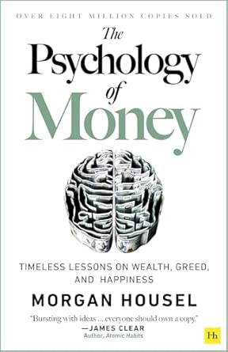

  

<h1 align="center">ترجمه فارسی کتاب The Psychology of Money</h1>

  درس‌هایی جاودان دربارۀ ثروت، حرص و طمع، و خوشبختی

  
  
  
  
  

<h1>

   <a href="https://hheydarian.github.io/Gitab/" target="_blank"><strong> گیتاب — نسخه آنلاین ترجمه </strong></a>

</h1>

---

## ✨ معرفی پروژه

کتاب **The Psychology of Money** (روان‌شناسی پول) نوشتهٔ **Morgan Housel** یکی از پرفروش‌ترین و عمیق‌ترین کتاب‌ها در حوزه رفتارهای مالی و مدیریت ثروت است.  
مورگان هاوسل در این اثر نشان می‌دهد که موفقیت مالی، لزوماً به هوش یا میزان دانش شما بستگی ندارد؛ بلکه مستقیماً به «رفتار» شما با پول مربوط می‌شود. 

این ریپازیتوری تلاشی است برای ارائهٔ نسخه‌ای فارسی، دقیق و روان از این کتاب ارزشمند برای جامعهٔ فارسی‌زبان. هدف ما ارائه ترجمه‌ای شفاف و ملموس است که به بهبود رابطه ذهنی و عملی افراد با مسائل مالی کمک کند 🚀

---

## ⚙️ پیش‌نیاز مطالعه

🔹 برای درک این کتاب نیازی به تخصص مالی یا دانش اقتصادی پیچیده ندارید؛ تمرکز کتاب روی روان‌شناسی و رفتارهای انسانی است.  
🔹 برای تجربهٔ بهتر در مرورگر، پیشنهاد می‌کنیم افزونه [فونت ایران](https://chromewebstore.google.com/detail/fontiran/edbchgkbejkdkdkpgenlaciegoidmjoh) را نصب کنید.

---

## 🙌 راه‌های مشارکت

ما از حضور و کمک شما برای بهتر شدن این منبع استقبال می‌کنیم. می‌توانید از مسیرهای زیر مشارکت داشته باشید:

- ✏️ **بازبینی و ویرایش متن برای بهبود روانی ترجمه**
- 💬 **پیشنهاد اصطلاحات ملموس‌تر برای مفاهیم رفتاری و مالی**
- 🎨 **بهبود بخش‌های ظاهری، تایپوگرافی و تصاویر صفحات**

---

## 🔗 فصل‌های کتاب (با لینک)

| شماره | نام فصل (انگلیسی) | نام فصل (فارسی) | وضعیت | لینک |
| :---: | :--- | :--- | :---: | :--- |
| 00 | Introduction | مقدمه: بزرگ‌ترین نمایش روی زمین | ✅ | [Introduction](Book/00/Introduction.md) |
| 01 | No One's Crazy | هیچ‌کس دیوانه نیست | ✅ | [No_Ones_Crazy](Book/01/No_Ones_Crazy.md) |
| 02 | Luck & Risk | شانس و ریسک | ✅ | [Lock%26Risk](Book/02/Lock%26Risk.md) |
| 03 | Never Enough | هرگز کافی نیست | ✅ | [Never_enough](Book/03/Never_enough.md) |
| 04 | Confounding Compounding | مربوط به تراکم | ✅ | [Confounding_Compounding](Book/04/Confounding_Compounding.md) |
| 05 | Getting Wealthy vs Staying Wealthy | ثروتمند شدن مقابل با ثروتمند ماندن | ✅ | [Getting_Wealthy_vs_Staying_Wealthy](Book/05/Getting_Wealthy_vs_Staying_Wealthy.md) |
| 06 | Tails, You Win | شیر یا خط، تو برنده‌ای | ✅ | [Tails_You_Win](Book/06/Tails_You_Win.md) |
| 07 | Freedom | آزادی | ✅ | [Freedom](Book/07/Freedom.md) |
| 08 | Man in the Car Paradox | پارادوکسِ مرد در ماشین | ✅ | [Man_in_the_Car_Paradox](Book/08/Man_in_the_Car_Paradox.md) |
| 09 | Wealth is What You Don't See | ثروت آن چیزی است که نمی‌بینید | ✅ | [ealth_is_What_You_Don't_See](Book/09/ealth_is_What_You_Don't_See.md) |
| 10 | Save Money | پول پس‌انداز کن | ✅ | [Save_Money](Book/10/Save_Money.md) |
| 11 | Reasonable vs Rational | معقول یا منطقی؟ | ✅ | [Reasonable_Retional](Book/11/Reasonable_Retional.md) |
| 12 | Surprise! | غافلگیری | ✅ | [Surprise](Book/12/Surprise.md) |
| 13 | Room for Error | جایگاه برای خطا | ✅ | [Room_for_Error](Book/13/Room_for_Error.md) |
| 14 | You'll Change | شما تغییر خواهید کرد | ✅ | [Youll_Change](Book/14/Youll_Change.md) |
| 15 | Nothing's Free | هیچ‌چیز مجانی نیست | ✅ | [Nothings_Free](Book/15/Nothings_Free.md) |
| 16 | You & Me | من و تو | ✅ | [You%26Me](Book/16/You%26Me.md) |
| 17 | The Seduction of Pessimism | اغواگریِ بدبینی | ✅ | [The_Seduction_of_Pessimism](Book/17/The_Seduction_of_Pessimism.md) |
| 18 | When You'll Believe Anything | وقتی هر چیزی را باور می‌کنید | ✅ | [When_You'll_Believe_Anything](Book/18/When_You'll_Believe_Anything.md) |
| 19 | All Together Now | حالا همه با هم | ✅ | [All%20_Together%20_Now](Book/19/All%20_Together%20_Now.md) |
| 20 | Confessions | اعترافات | ✅ | [Confessions](Book/20/Confessions.md) |
| 21 | Postscript: A Brief History | پس‌گفتار: یک تاریخچه کوتاه | ✅ | [A_Brief_History](Book/POSTSCRIPT/A_Brief_History.md) |

---

## 🧩 اصول ساختاری پروژه

- تمامی فصل‌ها با پسوند استاندارد Markdown (`.md`) نگارش و پیوند داده شده‌اند.  
- فایل‌های جانبی و کاور پروژه در پوشهٔ `assets/image/` مدیریت می‌شوند.  
- این پروژه بستر تعاملی دارد تا مخاطبان بتوانند اشکالات نگارشی را از طریق Pull Request رفع کنند.

---

## 🛡️ مجوز و حقوق نشر

<ul dir="rtl">
<li><b>حقوق نشر کتاب اصلی:</b> © Morgan Housel (نشر Harriman House)</li>
<li><b>متن ترجمه:</b> تحت مجوز <code>CC BY-NC-SA 4.0</code> منتشر می‌شود.</li>
</ul>

---

## 🌟 قدردانی

سپاس از همراهی تمام عزیزانی که در توسعه فرهنگ مطالعه و بومی‌سازی مراجع بین‌المللی گام برمی‌دارند.  
💬 هر نظر، ستاره یا بازبینی شما، دلگرمی بزرگی برای ادامه این مسیر است.

---

ساخته شده با ❤️ برای جستجوگران استقلال مالی

